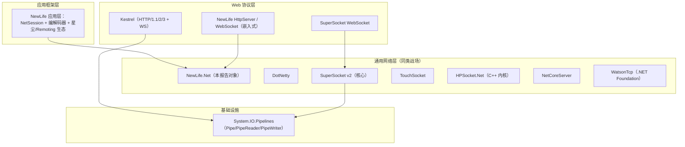

# 网络库竞品分析

> 报告日期：2026-09-17（v4.5 数据刷新 2026-09-23） ｜ 版本：v4.5 ｜ 分析范围：7 款主流框架 + 1 项基础设施基准
> 基线：v12 工作区（2026-09-17）｜ 数据：三份 BenchmarkDotNet 实测报告 ｜ 竞品资料：2026-09-16 官方调研
> v4.1 变更：UDS（Unix Domain Socket）支持已落地（2026-09-17），§1.3 / §3 / §11.2 / §12 / §13.2 状态刷新
> v4.2 变更：背压水位定档（入站 1M/512K 维持、出站收紧 64K/32K）并修复读饥饿死锁，§4 / §12 更新，见《背压水位定档与内存测算报告》
> v4.3 变更：裸 Socket 层全矩阵基准落地（38 场景，分离进程口径，含客户端接收模式对比），§1.3 / §9 / §11.2 / §12 / §13 / §14 数据刷新，见《裸Socket层性能测试报告》v2
> v4.4 变更：裸 Socket 基准 v3 换**服务端口径**并扩至 60+ 场景（并发/尺寸扫描、UDP Connect 化实验、服务端分配/GC 统计），§1.3 / §9 数据刷新，见《裸Socket层性能测试报告》v3
> v4.5 变更：UDP 会话查找去字符串键 + 客户端自动连接落地（服务端分配 330→216 B/msg，UDP 高并发吞吐 +7~25%），§1.3 / §9 数据刷新，见《裸Socket层性能测试报告》v3.1
> v4.6 变更：v12 协议契约大手术收口（`IMessageCodec`/`MessagePump` 单栈、SRMP 服务端并行 `MaxConcurrency`、WS 分片自动重组、`CompressedCodec` 装饰器；`PacketCodec`/`IFrameMessage`/`StandardCodec` 族已整删）——对比矩阵中相应行的旧形态描述待统一刷新，现行协议层见《消息协议栈》

---

## 1. 概述

本文档对比分析 7 款主流 .NET 网络框架及 1 项基础设施（System.IO.Pipelines，作为对标基准而非竞品），覆盖传输能力、I/O 模型、缓冲与内存管理、编解码扩展模型、客户端/服务器功能面、平台兼容与生态六大维度，并给出本库优势/差距清单、关键机制深挖与改进路线建议。

### 1.1 竞品清单

| 竞品 | 定位 | 与 NewLife 的关系 |
|------|------|-------------------|
| **Kestrel** | 微软 ASP.NET Core 跨平台 Web 服务器（HTTP/1.1、HTTP/2、HTTP/3、WebSockets） | 上层"Web 协议实现"对照：其传输抽象（IConnectionListenerFactory）、连接中间件、背压设计可作借鉴 |
| **DotNetty** | Netty 的 .NET 移植（事件驱动异步网络应用框架，Azure 出品） | **直接同类**：ChannelPipeline/EventLoop/ByteBuf 三大件与 NewLife 的管道/接收环/数据包体系逐一对照 |
| **SuperSocket** | 可扩展 Socket 服务器应用框架（v2 重写，基于泛型主机/DI） | **直接同类**：PipelineFilter 拆包 + Command 命令模型 + AppSession 会话，与 `NetServer`/`NetSession`/编解码器体系对应 |
| **HPSocket.Net** | 国产 C++ 通信内核 HP-Socket 的 .NET SDK（TCP/UDP/SSL/HTTP/WebSocket 全组件矩阵） | **直接同类（异构内核）**：内核为 C++（P/Invoke 绑定），代表"原生内核 + 托管绑定"流派；组件矩阵与 DataAdapter 体系对位 |
| **NetCoreServer** | 极简高性能异步 Socket 服务器/客户端库（TCP/SSL/UDP/UDS/HTTP/WebSocket，C10K 定位） | **直接同类（极简派）**：继承式 API（TcpServer/TcpSession）与 NewLife 模板方法风格几乎一致；每连接固定缓冲是"无池化简约派"标本 |
| **WatsonTcp** | .NET Foundation 旗下易用型 TCP 消息框架（内建分帧/元数据/流式传输/OpenTelemetry） | **直接同类（易用派）**：消息级抽象（永不暴露字节流），与 NewLife"帧 + 编解码器"形成"完全内建 vs 可插拔"对照 |
| **System.IO.Pipelines** | .NET BCL 流式 I/O 基础设施（Pipe/PipeReader/PipeWriter） | **对标基准**（非竞品）：`Pipe` 的明确对标物（v12 起类型与 BCL 同名、命名空间不同），且是 Kestrel/SuperSocket v2 的公共底座 |

> 选择理由：Kestrel 代表官方标准答案与性能标杆；6 款通用网络框架（DotNetty/SuperSocket/TouchSocket/HPSocket.Net/NetCoreServer/WatsonTcp）覆盖开源同类的主流流派——管道派/命令派/插件派/原生内核派/极简派/易用派；System.IO.Pipelines 提供缓冲/管道维度的黄金基准。

### 1.2 对比框架

六大维度矩阵（第 3~8 章）：传输与协议能力、I/O 与并发模型、缓冲与内存管理、编解码与扩展模型、客户端/服务器功能面、平台兼容与生态；其余分析章节（第 9~14 章）：性能数据对比、关键机制深挖、优势与差距清单、竞品功能遴选与改进建议、演进路线图与总结。

### 1.3 七大关注维度速查

面向本轮评审关注的七个维度，本库最新状态与竞品坐标的浓缩对照（详细论证按章索引）：

| 关注维度 | 本库最新状态（2026-09-18） | 竞品参照 | 结论 |
|----------|---------------------------|----------|------|
| **核心 I/O 模型** | SAEA 完成回调环（每会话多路并发待收：TCP 1、UDP CPU×1.6）+ 轮末引用计数裁决 + 投递双通道（数据管道主干 / 传统处理器链兼容） | Pipelines 系 async 读循环（Kestrel/SuperSocket）、EventLoop（DotNetty）、定制 IOCP（TouchSocket）、每会话固定缓冲（NetCoreServer/WatsonTcp） | **同档**——模型级差 ≈ 数十 ns/消息（§10.1 同条件裁决）；"廉价无限期留存"契约（句柄可跨轮持有）是本库独有优势 |
| **内存管理** | `ArrayPool` + `OwnerPacket` 引用计数 + `Slice` 共享切片 + 轮末裁决（无持有零 Rent/Return）+ DEBUG 终结器兜底告警 | `ByteBuf` 引用计数（DotNetty）、消费位置（Pipelines）、无池化（NetCoreServer/WatsonTcp）、内核池（HPSocket） | **领先**——轮末裁决是池化阵营中所有权自动化的最深一步；且唯一公开"分配/拷贝/GC 纳秒级"决策依据数据（§5） |
| **粘包处理** | 双引擎：`PacketCodec`（单链缓存 + 统一序列版 `GetFrameLength` + 零拷贝切帧/组链；帧首并段机制已移除）+ `PacketFramer`（头先行 / 整帧 / 同步泵流式帧泵） | `FrameDecoder` 族（DotNetty，含 maxFrameLength 即时拒绝）、`PipelineFilter`（SuperSocket）、`DataAdapter` 模板（TouchSocket/HPSocket）、内建分帧（WatsonTcp） | **引擎广度领先**（同步 + 流式双态全覆盖）；防护厚度仍缺 Netty 式"声明超长即拒"（§6/§10.2） |
| **协议支持** | TCP/UDP 双栈双协议（四监听聚合）+ TLS + WebSocket（双实现）+ 嵌入式 HTTP + **UDS（Unix Domain Socket，`unix://` 路径）**；任意二进制协议一等公民 | Kestrel（HTTP 家族窄而深：HTTP/2/3、SNI）；NetCoreServer（裸流 + 多协议对称）；WatsonTcp（消息即 byte[]） | **宽而浅 vs 窄而深**（定位差异）；UDS 已落地（2026-09-17），HTTP2 / SNI 为已识别差距（§3/§11.2） |
| **流式负载** | ✅ 已落地：`IFrameMessage`（`TryParseHeader` + `LimitedReader` Body）+ `PacketFramer` 帧泵；发送侧 `BuildHeader` + `SendAsync(Stream)`；HTTP `BodyStream` 与 WS 大帧流式 | Kestrel（Pipelines 底座原生）、TouchSocket HTTP（组件级）、WatsonTcp（大消息直读代理） | **并列领先**——"协议层通用契约 + 全 TFM"形态同类未见第二家；自 2026-09-17 起无"开发中"标记（§6/§10.2） |
| **吞吐性能** | 第一手数据（2026-09-23 全矩阵，分离进程、**服务端口径**；带宽为比特率）：TCP 单向 1KB 最优 32C=**13.7Gbps / 167 万 pkt/s**、64KB 4C=53.8Gbps、1MB=33.7Gbps；UDP 1KB 64C=4.08Gbps / 49.9 万 pkt/s、64KB 32C=**134.5Gbps**；粘包口径 TCP 2.18 亿 / UDP 4.22 亿 frame/s；服务端接收分配 TCP 0.08-4.8 B/msg（GC 全零）vs UDP 恒定 216 B/msg（已由 330 优化）；编解码 Echo 全链路 ~42–46 万 msg/s（滑动窗口）；流式发送 1MB=510µs（64KB 分块）；包级回环恒定 85ns | NetCoreServer 公开基准（自测 941 万 msg/s，32B 裸回环）；TouchSocket 10× 宣称；Kestrel TechEmpower | 口径不可跨家比较；本库为**裸层 + 含编解码全链路**双口径；已产出三份内部报告，**待整合发布**（§9） |
| **P99 延迟** | ✅ 裸 Socket 层已有分位实测（2026-09-23）：TCP 1KB 4C P50 48.2 / P99 74µs，64C P50 267-277 / P99 431-467µs（事件接收尾延迟最优）；UDP P50 32.6-48.7µs；含编解码协议层仍为均值口径（RTT ~30–34µs） | NetCoreServer 公开延迟数据（自测均值 106ns）；多数竞品无 P99 公开数据 | 裸层分位数据已补齐（《裸Socket层性能测试报告》v3.1）；协议层 P99 仍建议补测（§12） |

---

## 2. 定位校准与格局

### 2.1 为什么不能平铺对比

这些对象并不在同一层：Kestrel 是"HTTP 协议服务器"、System.IO.Pipelines 是"缓冲基础设施"，它们与 NewLife.Core 网络栈（通用网络层 + 内置 HTTP/WebSocket）存在部分重叠但定位不同。直接平铺排名会得出误导性结论（例如"Kestrel 不支持 UDP 所以不如 NewLife"——这恰恰是定位差异而非能力差距）。

先做分层校准，再按层对比：



### 2.2 三大技术流派

| 流派 | 代表 | 特征 | 缓冲底座 |
|------|------|------|----------|
| **微软系"共享底座"派** | Kestrel、SuperSocket v2（Kestrel 传输包） | 收敛到 `Microsoft.AspNetCore.Connections` 抽象（`ConnectionContext`/`IConnectionListenerFactory`）+ `System.IO.Pipelines`；协议实现以中间件逐层叠加 | System.IO.Pipelines（共享框架内置） |
| **自研一体栈派** | NewLife.Net、DotNetty、TouchSocket、NetCoreServer、WatsonTcp | 传输、缓冲、编解码、会话全部自研（C#），无 BCL 依赖或仅依赖 `System.Memory`；从“极致控制”到“极致简单”不等 | NewLife：`OwnerPacket` 引用计数 + `Pipe`；DotNetty：`ByteBuf` 池；TouchSocket：`ByteBlock`；**NetCoreServer/WatsonTcp：每连接固定缓冲/内建分帧（无池化体系）** |
| **原生内核派** | HPSocket.Net | 通信内核是 C++（HP-Socket，含原生线程池/内存管理/IOCP-EPOLL 封装），.NET 层仅为 P/Invoke 绑定与组件适配；性能与行为由内核决定 | HP-Socket 原生内存池（托管侧不可见） |

### 2.3 可比性对照

| 竞品 | 与 NewLife 可直接对比的维度 | 不可比/仅作借鉴的部分 |
|------|------------------------------|------------------------|
| Kestrel | 传输抽象、连接生命周期、背压、内存管理、TLS、超时/限流参数 | HTTP 协议语义（HTTP/2 流、HPACK）、Web 服务器部署模型（端口 0、SNI、Unix Socket） |
| DotNetty | ChannelPipeline、EventLoop、ByteBuf 池、编解码器（FrameDecoder）、Bootstrapping | Netty 用户生态、Java 语义移植负担 |
| SuperSocket | PipelineFilter 拆包、命令模型、会话服务、多监听、TLS、UDP | 泛型主机/DI 集成模型、WebSocket 服务端、命令式应用框架 |
| TouchSocket | IOCP 接收模型、每轮缓冲分配、DataAdapter、Plugin（重连/心跳）、统一 C/S API | MQTT/RPC/Modbus 等应用协议模组（NewLife 以独立包提供） |
| HPSocket.Net | 组件矩阵设计（Pull/Pack/Adapter 三风格）、DataReceiveAdapter 模板族、内核级内存管理 | C++ 内核细节、原生动态库跨平台部署方式 |
| NetCoreServer | 继承式 API 模型、每连接缓冲策略、多协议对称实现（TCP/SSL/UDP/UDS/WS 同一套模式）、已发布性能基准的组织方式 | 无拆包体系（纯字节流）、无会话集合以外的应用层设施 |
| WatsonTcp | 消息级 API（分帧/元数据/流）、断线检测哲学（真实读写失败而非轮询）、OpenTelemetry 集成、.NET Foundation 治理 | 纯消息框架（无原生协议扩展位）、无内建重连 |

> 以下第 3~8 章的矩阵以同类表为主（NewLife 与 6 款通用网络框架），部分维度附 Kestrel / System.IO.Pipelines 基准对照；各维度按可比性选列——不要求每个对象出现在每张矩阵中，避免"用不适用项制造劣势"的噪音。

---

## 3. 传输与协议能力

### 3.1 通用网络框架对照

| 维度 | NewLife.Net | DotNetty | SuperSocket | TouchSocket | HPSocket.Net | NetCoreServer | WatsonTcp |
|------|:--:|:--:|:--:|:--:|:--:|:--:|:--:|
| **TCP 服务端** | ✅ | ✅ | ✅ | ✅ | ✅ | ✅ | ✅ |
| **TCP 客户端** | ✅ `NetClient`/`ISocketClient` | ✅ Bootstrap | ✅ Client 包 | ✅ 统一 C/S API | ✅ 全组件矩阵 | ✅ | ✅ |
| **UDP** | ✅ 完整服务端/会话 | ✅ | ✅ Udp 包 | ✅ | ✅ 另含可靠 UDP「Arq」组件 | ✅ 含组播 | ❌（纯 TCP） |
| **IPv4+IPv6 双栈** | ✅ 同端口四监听自动创建 | ✅ | ✅ 多监听 | ✅ | ✅（内核支持） | ⚠️ 需手动 | ⚠️ 需手动 |
| **TLS/SSL** | ✅ 单证书 + 指纹校验回调 | ✅ SslHandler | ✅ TLS 文档 | ✅ SSL 模组 | ✅ SSL 组件全套 | ✅（含双向认证示例） | ✅（PFX/双向认证/TLS 版本可配） |
| **WebSocket 服务端** | ✅ 双实现（HTTP 升级 + Net 侧编解码） | ✅ 编解码器 | ✅ 完整实现 | ✅ | ✅ `IWebSocketServer` | ✅ Ws/Wss | ❌ |
| **HTTP 服务端** | ✅ 嵌入式 `HttpServer`（轻量路由） | ✅ 编解码器级 | — | ✅ Http 模组 | ✅（另含 Easy 封包组件） | ✅（含 Swagger/静态内容） | ❌（姊妹项目 WatsonWebserver） |
| **Unix Socket / 命名管道** | ✅ UDS 一等支持（2026-09-17，`unix://` 路径）；命名管道不做（功能与 UDS 高度重叠，Windows 亦支持 AF_UNIX） | ⚠️ | ⚠️ | ✅ 命名管道 | — | ✅ UDS 一等支持 | ❌ |
| **自定义传输扩展点** | ⚠️ 外部 Socket 接管（`TcpSession(Socket)` / `TcpServer.Attach`）+ `NetServer.AttachServer`（挂接自定义服务器） | ✅ Channel 抽象 | ✅ SerialIO 包 | ✅ | ❌（组件固定） | ❌（协议类固化） | ❌ |
| **协议无关性** | ✅ 原生任意二进制协议为一等公民 | ✅ | ✅ | ✅ | ✅（Pull/Pack 原始模式 + Adapter） | ✅（裸字节流 + FBE 协议集成） | ✅（消息即 byte[]） |

> 符号约定：✅ 支持 ｜ ⚠️ 有限/需配置/实验性 ｜ ❌ 不支持 ｜ — 未验证或未见官方资料（以官方仓库为准）。

### 关键差异

- **双栈双协议四监听聚合是 NewLife 独有**：`new NetServer { Port = 7777 }` 启动后自动创建 Tcp/Tcpv6/Udp/Udpv6 四个监听（随机端口还会回写同步）；Kestrel 需要逐 endpoint 声明，SuperSocket 的 Multiple Listeners 需要显式配置。这是"一把开箱即用"与"显式装配"的哲学差异。
- **协议宽度的两极**：Kestrel 协议窄而深（HTTP 家族做到极致：HTTP/2 流、HTTP/3 QUIC、SNI、限流参数族）；NewLife 协议宽而浅（任意二进制协议开箱即用，HTTP/WebSocket 作为内置子集提供）。二者覆盖的场景几乎不重叠，NewLife 的对照点在于"通用网络层的协议无关能力"。
- **UDP 象限**：NewLife 与 SuperSocket/TouchSocket/NetCoreServer/HPSocket.Net 提供完整 UDP 服务端（后两者另含组播，HPSocket 还有可靠 UDP「Arq」组件与 UDP 节点组件）；Kestrel/WatsonTcp 完全没有 UDP。NewLife 的 UDP 采用"按远端地址懒建会话 + 多客户端共享 Socket"模型（见架构文档附录 A），与 TCP 的每连接独占模型不同。
- **TLS 深度差距**：Kestrel 支持 SNI 多证书选择、ALPN 协商、按端点过滤；NewLife 目前是单证书 + 客户端指纹校验回调，无 SNI/ALPN——多域名托管场景需要前置反向代理。
- **Unix Socket 已补齐**：Kestrel（以及 .NET 平台本身）把 Unix Socket 作为 Nginx 后端的高性能部署方式一等支持，NetCoreServer 更是把 UDS 列为与 TCP/UDP 并列的基础协议（UdsServer/UdsClient/UdsSession）；NewLife 自 2026-09-17 起以 `unix://` 路径形式提供 UDS 传输（`NetServer`/`NetClient`/`HttpServer` 一等支持，含 socket 文件残留探测清理与老 TFM 降级），容器化部署与同机进程间 RPC 场景对齐；命名管道暂不提供（Windows 同样支持 AF_UNIX，功能重叠）。
- **自定义链路接入**：NewLife 走接入点路线——外部 Socket 接管（`TcpSession(Socket)` / `TcpServer.Attach`）接入既有连接（TLS 卸载等场景），`NetServer.AttachServer` 挂接自定义服务器实现，面向"链路由调用方提供/已有"的场景。
- **组件矩阵 vs 统一抽象**：HPSocket.Net 是本组中组件化最彻底的设计——每种传输 × 三种编程风格（原始拉模式 Pull / 推送 Pack / 适配器 Adapter）× 三种角色（Server/Agent/Client），外加端口转发、Easy HTTP 封包、WebSocket 专用组件等 40+ 组件；NewLife 反向选择"一套抽象覆盖全部"（`ISocket*` 接口族 + 80% 黄金用法 + 20% 扩展点）。前者为"开箱选组件"，后者为"一套 API 学到底"，工程取向截然不同。
- **内核异构的 trade-off**：HPSocket.Net 是本组唯一的"C++ 内核 + 托管绑定"模式——性能与成熟度来自 HP-Socket 多年的生产验证，代价是跨平台部署需随包携带各平台原生动态库、调试穿透到原生层、内核行为的问题排查链路更长；其余 6 款均为纯托管实现。这是与 NewLife"全 TFM 托管兼容"完全相反的兼容性策略。

---

## 4. I/O 与并发模型

| 维度 | NewLife.Net | Kestrel（Pipelines 系） | DotNetty | SuperSocket v2 | TouchSocket | HPSocket.Net | NetCoreServer | WatsonTcp |
|------|:--:|:--:|:--:|:--:|:--:|:--:|:--:|:--:|
| **底层接收模型** | SAEA 环形接收（按会话类型并发待收：TCP 1、UDP CPU×1.6，完成回调驱动）；投递双通道（数据管道主干 / 传统处理器链兼容） | 异步读循环：`await Transport.Input.ReadAsync()` 逐块读入 Pipe | EventLoop 轮询 + Channel 状态机 | 自研 Socket 连接（基于 Pipelines）或 Kestrel 传输包 | 定制 IOCP（每轮从内存池取新接收块） | IOCP/EPOLL 内核封装（缓冲由 C++ 内核管理） | 异步单读循环（每会话固定缓冲） | 异步读循环 + 内建分帧重组 |
| **接收并发** | ✅ 每会话多路 SAEA 并行（TCP 默认 1，UDP 默认 CPU×1.6，`UdpServer.MaxAsync` 可调） | 单读循环 + Pipelines 内部调度 | 单 EventLoop 串行化每连接 | 单读循环（Pipe） | IOCP 线程池并发 | 内核 Worker 线程池（可配） | 单读循环 | 单读循环 |
| **线程模型** | IOCP 完成回调 + 递归深度控制（>10 层转线程池） | 异步续体（线程池）+ `PipeScheduler` 可定制 | EventLoop 组（CPU×2 线程，单连接内串行免锁） | 异步续体（线程池） | IOCP 线程池 | C++ 内核线程池（可配） | 异步续体（线程池） | 异步续体（线程池） |
| **背压** | ✅ `Pipe` 迟滞水位（**入站 1M/512K**，Kestrel 入站 1MB 同量级；**出站 64K/32K**，对齐 BCL/Kestrel 出站 64KB 档），挂起 SAEA 接收（`ParkReceive`；读饥饿时自动让位防死锁）；✅ 写侧 `FlushAsync` 默认挂起（对齐 Pipelines） | ✅ Pipelines 水位（BCL 默认 64K 暂停 / 32K 恢复），`FlushAsync` 返回未完成任务挂起写侧 | ✅ `WriteBufferWaterMark` 高水位标记 `isWritable=false` | 同 Pipelines 水位 | ⚠️ 以官方为准 | — | — | — |
| **FIN/RST 关闭探测** | ✅ 显式 `CheckClosed`（Poll + Peek 探测 FIN） | EOF 语义（0 字节读表示对端关闭） | `channelInactive` 事件 | EOF 语义 | ✅ 事件模型 | ✅ 内核关闭事件 | ✅ EOF 语义 | ✅ **读写失败即时检测**（非轮询设计） |
| **超时与保活** | `Timeout`（连接/收发，默认 3s）、Socket 级 KeepAlive、会话空闲超时剔除 | 参数族：KeepAliveTimeout 2min、请求头超时 30s、最低数据速率 240B/s + 宽限期 | `IdleStateHandler` | 会话空闲超时 | ✅ 心跳插件 | ✅ 内建 KeepAlive 配置（内核级） | — | ✅ 空闲超时 + IdleServerMonitor（keepalive 默认关） |

> 注：SuperSocket v2 的内置 Socket 连接基于 System.IO.Pipelines 实现；选用 `SuperSocket.Kestrel` 包时复用 ASP.NET Core 的 Kestrel 传输。表中 SuperSocket 列的"同 Pipelines"均指该体系。

### 关键差异

- **接收模型的代际差异**：NewLife 的 SAEA 环是"完成端口原生"模型——事件参数与接收缓冲均可复用（池化），为"轮末引用计数裁决、无外部持有零 Rent/Return"提供了基础；Pipelines 系是"异步循环 + 共享缓冲池"模型——代码极简（一个 `while` 读循环）但每块缓冲都要经历池进出（BCL 内部实现，成本已很低）。这是"极致控制权"与"极致简洁"的取舍。其余三家的位置：HPSocket.Net 把接收完全交给 C++ 内核（托管侧看不到 IO 细节与缓冲分配）；NetCoreServer/WatsonTcp 是教材式"每会话固定缓冲 + 单读循环"（零池化、以简洁换性能上限）；完整接收模型谱系与 SAEA / 管道两种主流形态的同条件裁决见第 10.1 节。
- **线程模型各有软肋**：DotNetty 的 EventLoop 单线程串行化免除了每连接锁竞争，但任何阻塞调用都会卡死整个 EventLoop 组；NewLife 的 IOCP 回调模型天然并行，但需通过递归深度控制（`_IntoThreadCount`）防止回调栈耗尽，且"同一连接的多次回调并发性"由接收环并发数决定（UDP 可经 `UdpServer.MaxAsync` 调优）。两者都需要开发者理解模型边界。HPSocket.Net 把线程模型完全下沉到 C++ 内核（可配 Worker 线程池 + 原子/无锁队列设计），托管侧零调度把控——性能上限高，但调优需懂内核参数。
- **背压能力全景**：7 款同类中只有三款有明确背压机制——NewLife（读侧迟滞水位 + 写侧 `FlushAsync` 挂起，双向）、Pipelines 系（双向水位）、DotNetty（写侧高水位 `isWritable` 标记）；HPSocket/NetCoreServer/WatsonTcp 均未见公开的水位背压机制（以官方资料为准）。这印证背压属"现代进阶能力"，本库处于第一梯队。另一视角：水位定档已按数据完成（2026-09-17）——入站 1M/512K 与 Kestrel `MaxRequestBufferSize`（1MB）同量级，出站 64K/32K 对齐 BCL 默认与 Kestrel `MaxResponseBufferSize`（64KB）；各档位吞吐实测无差异，并修复了“读饥饿死锁”（读侧挂起等待时自动让位），依据见《背压水位定档与内存测算报告》。
- **FIN/RST 处理的工程细节**：NewLife 用 `Poll + Peek` 显式探测 FIN（`CheckClosed`），这在 SAEA 模型中必要（完成回调不区分"有数据"与"对端关闭"）；Pipelines 系由异步读的 0 字节返回值自然表达，更简洁。两者在 RST（连接重置）处理上都收敛到"关闭会话 + 触发错误事件"。WatsonTcp 的哲学更进一步——不做任何主动轮询，以"真实读写失败"作为断线判据（配合服务端空闲超时兜底），把断线检测成本压到零轮询；这与 NewLife 的显式探测、Pipelines 的 EOF 语义构成三种典型方案。
- **超时参数谱系**：Kestrel 的超时是 Web 服务器语义（Keep-Alive、请求头窗口、最小数据速率），用于防御慢速攻击；NewLife 的超时是 Socket 语义（连接/收发套接字选项 + 会话空闲剔除），用于资源回收。NewLife 缺失"慢速客户端防御"层（最小数据速率类的保护）——需要者应前置代理。WatsonTcp 用服务端空闲超时 + 客户端 IdleServerMonitor（静默监控）双向兜底；HPSocket.Net 把 KeepAlive 下沉到内核级配置——NewLife 处在中间（Socket KeepAlive + 会话空闲剔除，无客户端侧监控）。

### API 形态（同步/异步）

| 框架 | 流派 | 连接 | 发送 | 依据 |
|------|------|------|------|------|
| Kestrel / System.IO.Pipelines | 全异步 | — | 无同步发送（Pipe 读写全异步） | 框架契约 |
| DotNetty | 全异步 | `Task` 工厂 | `IChannel.WriteAsync`（唯一写入口） | API 面 |
| SuperSocket v2 | 全异步 | — | `ValueTask SendAsync` | 官方文档 |
| WatsonTcp | 全异步 | — | `Task<Boolean> SendAsync` | API 面 |
| TouchSocket | 双轨 | 双轨 | 同步发送保留（官方明示"三种同步发送方法"）+ 异步 | 官方文档 |
| HPSocket(.Net) | 双轨 | 双轨 | 同步/异步并存（C++ 内核队列承接） | 组件矩阵 |
| NetCoreServer | 双轨 | `Connect()`/`ConnectAsync()` 并存 | `SendAsync` 入队即返回 | 源码 |
| BCL `Socket` | 双轨 | `Connect`/`ConnectAsync` | `Send`/`SendAsync` 并存 | 平台基座 |

**规律**：全异步派均为**高层框架**（HTTP 服务器、RPC、消息服务），把异步写死进契约；**字节级底层库（BCL Socket / NetCoreServer / HPSocket / TouchSocket）全部保留同步面**——没有一家砍掉同步发送。本库定位与后者一致，同步直发为默认快路径、异步与背压按需启用（双轨决策与场景选型见《网络库同步异步分工》）。

---

## 5. 缓冲与内存管理（本库核心竞争章）

### 5.1 同类框架缓冲与内存对照

| 维度 | NewLife | DotNetty | TouchSocket | SuperSocket | HPSocket.Net | NetCoreServer | WatsonTcp |
|------|:--:|:--:|:--:|:--:|:--:|:--:|:--:|
| **缓冲池体系** | `ArrayPool`（256B 分档）+ 自研 `OwnerPacket` 引用计数句柄 | `PooledByteBufAllocator`（arena 分层，jemalloc 风格） | `MemoryPool` + `ByteBlock` 可复用缓冲 | System.IO.Pipelines（内置 Socket 连接） | C++ 内核原生内存池（托管侧回调为拷贝的 `byte[]`） | ❌ 无池化（每会话固定 `byte[]`） | ❌ 无池化（内部分帧缓冲） |
| **零拷贝窗口** | `ReadOnlySequence` 桥接（`PacketHelper.AsReadOnlySequence`，单段快路径零分配） | `ByteBuf` 切片（retain/release） | `Span`/`Memory` 窗口 | 同 Pipelines | ❌ 托管侧为拷贝语义 | ⚠️ 借用窗口（回调内有效） | ❌ 消息 `byte[]` 交付 |
| **引用计数** | ✅ `OwnerPacket.RefCount`（每句柄独立 Dispose，归零归还池） | ✅ `ByteBuf.refCnt`（显式 `retain`/`release`） | 框架托管（ByteBlock 生命周期） | 同 Pipelines 分段计数 | — | — | — |
| **所有权契约（谁释放）** | **显式句柄**：首轮包装 + 轮末裁决（`RefCount==1` → 句柄回挂、下轮重设窗口复用；否则换新）；跨轮带出经 `Slice` 共享 | **显式计数**：调用方必须配对 release，泄漏靠检测器兜底 | 框架托管 | 同 Pipelines（AdvanceTo） | 即用即弃（拷贝后无需释放） | 回调窗口制（无显式释放） | 即用即弃（无释放负担） |
| **链式多段数据** | ✅ `IPacket.Next` 链 + 序列桥接（全链零拷贝视图） | ✅ `CompositeByteBuf` | ✅ | 同 Pipelines | — | ❌（单数组） | ❌ |
| **头部跨段解析** | ✅ 双轨：协议解析已迁移 `SequenceReader<T>` 顺序读取（垫片全 TFM 可用——低版本自带实现、高版本转发 BCL，共享代码避开 `TryPeek(offset)`/`UnreadSequence`）；`IPacket` 链头部直读用 `PacketHelper.GetPrefix` 跨段拼读 | `ByteBuf` 随机访问（逻辑连续） | ✅ | 同 Pipelines | ✅（Adapter 头/体分段交付） | ❌（自行拼接，FBE 集成为例） | ✅（分帧重组内建） |
| **小帧拷贝 vs 大帧零拷贝** | ✅ 有实测分界指导：<2KB 拷贝、2~4KB 分界、≥4KB 零拷贝（《内存分配与拷贝成本报告》），代码层未强制 | 无显式策略 | 部分（压测数据支撑的 IO 策略） | 无显式策略 | 无显式策略 | 无显式策略 | ⚠️ 大消息流式代理（Stream 重载） |
| **池缓冲归还保证** | 轮末裁决 + DEBUG 条件编译终结器兜底（漏释放告警） | release 纪律 + ResourceLeakDetector | 框架保证 | 同 Pipelines | 内核托管 | —（无池） | —（无池） |
| **GC 成本量化** | ✅ 第一手基准：Rent/Return ~8ns 恒定、拷贝 1.4ns@64B→2.8µs@128KB、128KB 分配+拷贝触发 Gen2 ×41.7/千次、85KB LOH 悬崖 | 有历史基准 | 宣称 100k×64KB 压测 10× 于传统模型 | — | — | ✅ 公开吞吐基准（无分配量化） | — |

### 5.2 基础设施与平台基准对照

| 维度 | System.IO.Pipelines | Kestrel |
|------|:--:|:--:|
| **缓冲池体系** | `MemoryPool<Byte>`（池段链，BCL 默认 4K 段） | Kestrel 专用内存池（PinnedBlockMemoryPool，段大小可配） |
| **零拷贝窗口** | `ReadOnlySequence` 原生 | 同左 |
| **引用计数** | ✅ `BufferSegment` 内部引用计数 | 同左 |
| **所有权契约（谁释放）** | **隐式位置**：`AdvanceTo(consumed, examined)` 标记消费位置，管道自动回收 | 同左 |
| **链式多段数据** | ✅ 原生分段序列 | 同左 |
| **头部跨段解析** | `SequenceReader<T>`（.NET Core 3+）/ BufferExtensions | 同左 |
| **小帧拷贝 vs 大帧零拷贝** | 无显式策略（交给使用者） | 无显式策略 |
| **池缓冲归还保证** | `AdvanceTo` 协议 + `Complete`；误用后果：挂起/OOM（官方专章列出 5 类常见错误） | 同左 |
| **GC 成本量化** | BCL 内部有优化，未公开等粒度量化 | 有公开性能博客 |

### 关键差异

- **引用计数本质同构，API 契约走向两种哲学**：`OwnerPacket.RefCount`（NewLife）与 `BufferSegment`（Pipelines）、`ByteBuf.refCnt`（Netty）在机制上都是"按句柄计数、归零归还"。差异在**如何表达生命周期**：
  - Pipelines 用**消费位置**隐式表达——"你告诉我消费到哪，剩下的我管"。忘记 `AdvanceTo` 的后果是挂起或 OOM（官方文档用一整章列出 5 类误用），但正常情况下使用者完全不碰内存管理代码；
  - NewLife 用**可处置句柄**显式表达——"每个句柄你 Dispose"。跨 `await`、跨线程、进队列、进缓存的所有权转移都通过 `Slice`/`Dispose` 表达，DEBUG 构建下有终结器兜底告警（漏释放打印告警而非静默泄漏）；
  - Netty 用**显式 retain/release**——控制力最强，纪律负担最重（泄漏检测器是生态必需品）。
  - 三者中 NewLife 的契约最接近"C++ 智能指针"式直觉；这是为"帧要跨轮持有、进请求-响应匹配队列、被应答链消费"等异步场景设计的（Pipelines 的"窗口仅在 AdvanceTo 前有效"契约在这些场景需要大量拷贝）。
  - 另三家给出第三种答案——**不引入所有权**：NetCoreServer（每会话固定缓冲，借用窗口）、WatsonTcp（消息 `byte[]` 即用即弃）、HPSocket（内核托管 + 拷贝出栈）都用"拷贝一次"换取"零释放负担"。所有权问题的终极解法有时是不引入所有权——这与 NewLife 的"零拷贝 + 显式句柄"是两条良性路线，取舍取决于对"高吞吐指标"与"开发心智负担"的偏好。
- **轮末裁决是本库最独特的机制**：接收回调拿到的"每轮拥有句柄"在轮末按引用计数裁决——没有下游持有时句柄回挂接收槽、下一轮重设窗口复用（缓冲原地不动，零 Rent/Return）；有持有者时解绑换新。TouchSocket 的 IOCP 优化是"每轮从池取新块"（README 宣称相比共享缓冲拷贝模型最高 10×），NewLife 的裁决机制在此基础上进一步省掉了"无外部引用时的行列进出"——两者是同一优化方向的两个阶段。对照之下：NetCoreServer/WatsonTcp 因无池化"连这个问题都不存在"（每会话固定缓冲/分帧缓冲，性能上限受限于固定缓冲策略）；HPSocket 把缓冲完全交给 C++ 内核。"轮末裁决"是池化阵营中所有权管理的最深一步优化。
- **量化能力的差距（优势面）**：NewLife 是这批框架中唯一公开"缓冲成本第一手量化报告"的（Rent 与拷贝的纳秒级成本 × 7 个大小档位 × 6 种操作，含 GC 计数）。Kestrel 有官方性能博客、TouchSocket 有压测宣称，但同等粒度的"决策依据型"数据未见公开。NetCoreServer 公开了全套吞吐/延迟基准（实测本机 TCP 单连接 941 万 msg/s、延迟 106ns、287 MiB/s；环境为 i7-4790K），发布组织方式值得 NewLife 借鉴（见第 12 章 P0），但其无分配/GC 维度量化——分配维度量化仍为 NewLife 独家。
- **待补差距（本库短板）**：
  1. **（v12 已解决）写侧回压**——`Pipe.Writer.FlushAsync` 默认挂起至水位恢复（对齐 Pipelines），出站 `SendPipe` 发送泵与 `SendAsync(Stream)` 贯通双向背压；
  2. **池分层**：BCL 已演进到 `MemoryPool<Byte>`/`PinnedBlockMemoryPool` 式分级池与固定内存（POH）控制，NewLife 仍是 `ArrayPool` 单层——大缓冲（>85KB LOH 悬崖之上）虽有"必须零拷贝"的指导，但池化大块的策略未系统化（对照：Kestrel 用 PinnedBlockMemoryPool 避开 LOH 与 GC 移动；HPSocket 用内核内存池 + 预分配策略支撑高吞吐）；
  3. **`SequenceReader<T>` 垫片自持（残余代价）**：垫片已升级为 3.1 面（net45~ns2.0 自带实现、高版本 `TypeForwardedTo` 转发 BCL），全 TFM 可用，协议解析（`DefaultMessage`/`WebSocketMessage`/`LengthFieldCodec`）已迁移为序列顺序读取；需长期维护这份 corefx 移植垫片，且跨 TFM 共享代码要避开 `TryPeek(offset)`/`UnreadSequence`（ns2.1/netcoreapp3.1 的 BCL 缺这两个成员）。

---

## 6. 编解码与扩展模型

| 维度 | NewLife | DotNetty | SuperSocket v2 | TouchSocket | HPSocket.Net | NetCoreServer | WatsonTcp |
|------|:--:|:--:|:--:|:--:|:--:|:--:|:--:|
| **扩展主模型** | `IPipeline` Handler 双向链（Read/Write/Open/Close/Error）+ 数据管道 | `ChannelPipeline`（Inbound/Outbound Handler 链） | `PipelineFilter`（拆包器）+ Middleware + Command | `DataAdapter`（拆包适配器）+ `Plugin`（生命周期插件） | `DataReceiveAdapter`（4 模板）+ 3 风格组件（Pull/Pack/Adapter） | 继承式（重写 `OnReceived`/`OnConnected` 虚方法） | 消息事件/回调双轨（`Events.*`/`Callbacks.*`） |
| **粘包拆帧方案** | 双引擎：`PacketCodec`（同步兼容面，统一序列版 `GetFrameLength` 委托）+ `PacketFramer`（头先行流式帧泵） | `FrameDecoder` 族（`LengthFieldBasedFrameDecoder` 等内置） | `PipelineFilter`（固定头/终止符/命令行内置模板） | `DataAdapter` 模板（固定头/固定长/终止符/HTTP/WS 内置） | ✅ Adapter 模板族（固定头/固定长/终止符/区间）+ Pack 组件 | ❌（裸字节流；FBE 集成为例） | ✅ 内建分帧（JSON 头 `{"len":N}` + `\r\n\r\n`） |
| **头部先行 / 流式负载** | ✅ 帧契约 `IFrameMessage` 已落地：`TryParseHeader` 头到齐即交付 + `Body` 限长流式 + 未读自动对齐；`PacketFramer` 帧泵跨轮等待（2026-09-17） | ⚠️ 通用拆帧器整帧；HTTP 编解码器头/体分片（`HttpRequest` + `HttpContent`，可聚合） | ⚠️ 整包过滤器为主；`PackageParts` 分阶段过滤基类（WebSocket/代理协议） | ⚠️ HTTP 组件头先行 + body 由 `PipeReader` 流式（流式表单读取器）；通用适配器整包 | ⚠️ HTTP/WS 组件头/体事件分离（`OnHeadersComplete`/`OnBody`）；通用 Adapter 头/体两段 | ❌（裸字节流，自建） | ✅ 分帧头 + 大消息连接流直读（阈值 `MaxProxiedStreamSize`；未读尾部排空，异步流回调） |
| **请求-响应匹配** | ✅ `MessageCodec` 匹配队列 + `SendMessageAsync`（池化 ValueTask 零分配） | ⚠️ 需自行组合（Netty Promise 语义未移植完整） | ✅ Command 请求-响应模型 | ✅ RPC 模组 | ❌（事件模式，需自建） | ⚠️（FBE 协议层提供请求-响应样例） | ✅ `SendAndWaitAsync` |
| **会话级状态隔离** | ✅ 处理器跨会话共享 → 跨轮状态挂会话键 `ss["Codec"]`（显式纪律 + 测试覆盖） | ✅ 每 Channel 独立 Pipeline 实例（规避共享态） | ✅ `AppSession` 每连接实例 | ✅ 每 Client 实例 | ✅ 连接 ID/附加数据 | ✅ 每会话实例字段 | ✅ 每连接事件参数 |
| **内置协议/编解码集** | SRMP（`StandardCodec`）、`LengthFieldCodec`、`SplitDataCodec`、`JsonCodec`、WebSocket（双实现）+ 嵌入式 HttpServer | 最全：HTTP/WS/Redis/Protobuf/SOCKS 等（Netty 遗产） | 命令行（Telnet）、WebSocket、Protobuf、MessagePack | HTTP/WS/MQTT/Modbus/RPC/JSON-RPC | HTTP(S)（含 Easy 封包）、WebSocket、端口转发 | HTTP(S)（含 Swagger/静态内容）、Ws/Wss（轻量） | 无（纯消息框架；HTTP 由姊妹项目 WatsonWebserver 承担） |
| **插件/中间件生态** | Handler 链可自由组合；现成的"插件市场"无 | Handler 生态最大 | Command + 中间件 + DI 集成 | Plugin 现成（重连/心跳/认证/日志） | ⚠️ Adapter 可自定义（无插件体系） | ❌（无插件体系，以继承扩展） | ❌（无插件；OpenTelemetry 遥测内建） |

### 关键差异

- **多流派同构，扩展位置决定了可插拔深度**：NewLife `IPipeline` Handler 链 ≈ DotNetty `ChannelPipeline` ≈ SuperSocket `PipelineFilter + Middleware` ≈ TouchSocket `DataAdapter + Plugin`；HPSocket/WatsonTcp/NetCoreServer 把"扩展"上移或封顶——HPSocket（Adapter 包级）、WatsonTcp（无扩展位，消息级 API 封顶）、NetCoreServer（无扩展位，以继承虚方法为唯一扩展点）。共性都是"双向处理链 + 会话绑定上下文"；差异在**注册方式**（NewLife 逐层 `Add<T>()`、DotNetty 命名 Handler 逐层 addLast、TouchSocket 声明式 `.ConfigurePlugins`）与**粒度的默认值**（NewLife 内置 7 个编解码器直接可用；DotNetty 需要挑选组合；SuperSocket/TouchSocket 以"拆包器"为第一抽象）。
- **抽象层级谱系**：从字节流（NetCoreServer）→ 帧（NewLife/SuperSocket/TouchSocket/DotNetty/HPSocket）→ 消息 + 元数据（WatsonTcp）→ HTTP 语义（Kestrel 引擎内建，对用户完全透明），抽象逐级上升，每级都是"控制力"与"开箱度"的一个取舍点。NewLife 定位在帧级并向上保留消息抽象位（`IMessage`/`IMessageCodec`），向下保留字节流位（`Pipe`）——是少数"全谱系可达"的设计（代价是概念面较宽）。
- **双引擎是本库独有产物**：`PacketCodec`（同步、整包拆帧、共享切片切帧）与 `PacketFramer`（异步流式、头先行、背压集成）并存，兼容全 TFM 与存量协议；其余框架均为单引擎。代价是概念面更宽（架构文档专门用一节讲"双帧引擎选型规则"与冻结决策）；收益是双引擎共享统一序列版帧长委托（一处定界、两态通吃）、存量协议以适配委托为代价迁移（旧 `GetLength`/`GetLength2` 双委托已删除；三参 `Slice`/`Rent`/`Return` 等兼容壳保留）。
- **会话状态隔离的显式纪律**：NewLife 的处理器实例跨会话共享（服务器管道被所有会话引用），跨轮状态必须挂 `ss["Codec"]` 会话键——这是 v12 重构中的血泪教训（曾因处理器实例字段导致多客户端并发串包）；DotNetty 用"每 Channel 独立 Pipeline 实例"从结构上规避同类问题。两种方案都正确，本库的口径是"共享实例 + 文档纪律 + 测试锚定"。
- **应用化程度的差距（值得借鉴）**：SuperSocket 的 Command 模型（命令路由 + 参数绑定）与 TouchSocket 的 Plugin 生态（重连/心跳/认证开箱即用）都把手写 `OnReceive` 分发推进到了"声明式应用框架"；NewLife 的对应能力（`NetSession.OnReceive` + 手工分发）更原始，企业场景的常见需求（命令模式、鉴权过滤器）每次都需重写。NewLife 生态层的 `NewLife.Remoting`（ApiServer/ApiClient 提供 RPC 分发）实际承担了这部分职责，但未并入网络库本身。
- **请求-响应匹配的档次**：NewLife 的 `SendMessageAsync`（帧匹配队列 + 池化 ValueTask 源 + 取消令牌 + 无等待方应答归还，测试覆盖 4 组合）在此批次框架中属于第一梯队完工程度；DotNetty 的 Promise 语义移植不完整。值得进一步评估"强类型 await 封装"（基于现有 `SendMessageAsync` 封装即可，无需改内核——见第 12 章 P1）。

---

## 7. 客户端与服务器功能面

### 7.1 同类框架功能对照

| 维度 | NewLife | TouchSocket | SuperSocket v2 | HPSocket.Net | NetCoreServer | WatsonTcp |
|------|:--:|:--:|:--:|:--:|:--:|:--:|
| **自动重连** | ✅ `NetClient`（一次性定时器 + 延迟/最大次数可配；主动 Close 不触发） | ✅ Reconnection 插件（策略可配） | ⚠️ 需自行实现 | — | ❌（示例层手动 Timer 重连） | ❌（无内建） |
| **心跳保活** | ⚠️ Socket 级 KeepAlive；应用层心跳需自实现 | ✅ 心跳插件（超时剔除） | ✅（会话空闲超时机制） | ✅ 内核 KeepAlive 配置 | ❌ | ⚠️ 协议预留守望码（未启用）；keepalive 默认关 |
| **请求-响应 RPC** | ✅ `SendMessageAsync` 帧匹配队列 | ✅ RPC 模组 | ✅ Command 模型 | ❌（事件模式） | ⚠️（FBE 协议层样例） | ✅ `SendAndWaitAsync` |
| **广播/群发** | ✅ `SendAllAsync`/`SendAllMessage`（谓词过滤） | ✅ 群发 | ✅ 会话集合遍历 | ✅ 群发/分组发送 | ✅ Multicast | ✅ 发送全部/指定客户端 |
| **会话集合与统计** | ✅ `Sessions`/`SessionCount`/`MaxSessionCount`/周期统计日志 | ✅ | ✅ | ✅ 连接统计（内核计数器） | ✅ 会话集合（无统计） | ✅ 客户端列表 |
| **日志与 APM 追踪** | ✅ `ILog` + `ITracer`（星尘 APM 集成）+ Socket 层/应用层双日志分层 | ⚠️ 日志插件 | ⚠️ DI 日志 | ⚠️ 日志回调 | ❌（Console 输出） | ✅ **OpenTelemetry 遥测内建** |
| **优雅停止** | ✅ `Stop(reason)` 释放全部会话与监听（原因贯穿日志） | ✅ | ✅ | ✅ | ✅ `Stop`/`Restart` | ✅ |
| **多节点负载均衡** | ✅ `LoadBalancer`（Failover/轮询/竞速三策略，服务多节点客户端调用层；`ApiHttpClient` 集成） | ⚠️ | — | — | — | — |
| **断线状态恢复** | ⚠️ 仅重连，无消息续传/状态快照 | ⚠️ | ⚠️ | ❌ | ❌ | ❌ |

### 关键差异

- **重连能力的档位**：`NetClient.AutoReconnect` 是"网络连通性恢复"级别的重连（定时器重试 + 计数上限 + 日志）；"会话体验恢复"级别（指数型退避序列 + 断线期间出站消息缓冲 + 重连生命周期事件 + 可选状态快照）在通用网络库中普遍缺失（多由应用层自建）。行业全景：内建自动重连是少数派——NetCoreServer（示例层 Timer 重连）与 WatsonTcp（无）均需应用层自建；TouchSocket（插件）与 NewLife（NetClient）属"有"阵营。"退避策略可配置"与"重连期间消息不丢"是 NewLife 可低成本借鉴的两点（见第 12 章）。
- **广播模型的适用面**：`SendAllAsync` 的谓词过滤（`Func<INetSession,Boolean>`）在单机内足够灵活；"多实例集群"级的组/用户模型 + backplane 超出单机网络库职责范围（NewLife 生态的对位是星尘/Remoting 的多节点体系）。其余各家的群发能力均在"基础级"：HPSocket（SendToAll/分组）、NetCoreServer（Multicast）、WatsonTcp（SendToAll）都无谓词过滤概念——NewLife 的谓词过滤在同类中仍属第一梯队。
- **负载均衡的分层**：NewLife 的 `LoadBalancer` 在"客户端多节点调用层"（服务于 `ApiHttpClient` 等场景，策略为 Failover/轮询/竞速）；代理网关层的"服务端选目标节点"是另一层语义。NewLife 方向正确且策略已具备，缺的是"健康检查 + 与网络会话联动"的完整闭环。
- **可观测性（优势面）**：NewLife 的 `ILog`（可插拔日志）+ `ITracer`（星尘 APM 埋点贯穿 Open/Close/发送/接收/帧处理）双轨在同类中完整度高：`NetServer` 有 Socket 层/会话层/应用层三级日志开关与统计定时器；DotNetty/SuperSocket 主要依赖宿主 DI 日志，追踪需自行埋点。新参照：WatsonTcp 内建 **OpenTelemetry** 遥测（以行业标准对接可观测性后端）——NewLife 的 ILog/ITracer 是自有生态（星尘），若要进入云原生可观测体系需要 OTel 桥接（列入第 12 章建议）。
- **优雅停止都有**，但参数化程度不同：NewLife `Stop(reason)` 把关闭原因写进日志与 `CloseReason` 字段（排障友好）；`CloseAsync` 还会完成数据管道（挂起读取立即完成）并释放挂起的接收参数——关闭路径的完备性有专项测试锚定。

---

## 8. 平台兼容与生态

| 维度 | NewLife | DotNetty | SuperSocket v2 | TouchSocket | HPSocket.Net | NetCoreServer | WatsonTcp |
|------|:--:|:--:|:--:|:--:|:--:|:--:|:--:|
| **最低框架** | **net45** | netstandard2.0+ | net6.0+ | net462 / ns2.0 / net6+ | **Framework 2.0+ / Core 2.0+ / NET5+** | ns2.0+（源码基线 net6） | ns2.0/2.1、net462/48、net8/10 |
| **TFM 覆盖面** | **18 个**（net45/461/462、ns2.0/2.1、netcoreapp3.1、net5~net10 + windows 变体） | 2~3 个 | 2~3 个 | 3 类 | 宽（Framework/Core/Net 全系） | 2~3 类 | 5 类 |
| **AOT / Trim 兼容** | ⚠️ 未声明专项支持（反射应用较广） | ❌（反射/动态重） | ⚠️ | ⚠️ | —（原生库 + P/Invoke） | — | — |
| **包结构** | 单包巨石（`NewLife.Core` 一个引用获得全部） | 多包分层（Buffers/Codecs/Transport） | **16+ 包**（ProtoBase/Server/Client/WebSocket/Udp/SerialIO/ProtoBuf/MessagePack…） | 多包 + 商业 Pro 版 | 单包 + 各平台原生动态库 | 单包（仓内含基准/示例） | 单包 |
| **第三方依赖** | **零第三方依赖**（仅 System.* 兼容包） | 少 | Microsoft.Extensions 全家桶 | 少 | 零托管依赖（原生库内嵌） | 零第三方依赖 | 少 |
| **项目资历** | 2005 年至今（20+ 年） | 2015 年起（移植 Netty） | v1 2008 年起，v2 2021 起重写 | 2021 年起 | 2014 年起（HP-Socket 内核） | 2019 年起 | 2018 年起（以官方为准） |
| **社区规模（GitHub Stars 量级）** | 主仓量级与国内影响力为主（以仓库为准） | 4.3k | 4.2k | 1.3k | 221（C# 绑定；内核国内知名度高） | **3.1k** | 672（.NET Foundation） |
| **文档语言** | 中文为主（newlifex.com）；英文资料少 | 英文 | 英文为主（中文社区译介） | 中英双语 | 中文为主（HP-Socket 文档丰富） | 英文（GitHub Pages 文档 + 丰富示例） | 英文（README/FRAMING/ARCHITECTURE 齐全） |
| **商业化/支持** | 开源 MIT（支持私有化替换） | 社区 | 社区 | 社区 + Pro 企业版 | 开源 Apache-2.0 | 开源 MIT | 开源 MIT + .NET Foundation 治理 |

> ASP.NET Core 系（Kestrel 对照）：最低框架随 ASP.NET Core 支持周期滚动（当前 net8.0+）；TFM 为当期 3~4 个；AOT/Trim 已验证支持；细粒度官方包；依赖 ASP.NET Core 全家桶；资历 2014 年起；官方文档（含中译本）；官方多渠道支持。

### 关键差异

- **18 TFM 是最宽的全矩阵**，net45 起点对老工业上位机/桌面项目有独价值（同类中 TouchSocket 最低 net462、SuperSocket v2 直接放弃 net4x、ASP.NET Core 系只随当期版本）；HPSocket.Net 虽宣称支持 Framework 2.0+，但走的是原生库路线（部署需携带各平台动态库），托管兼容的"难度系数"不同。WatsonTcp 五类 TFM（含 ns2.0/net462/net10）是易用型框架里兼容面较宽的。代价明确：`System.IO.Pipelines`/`RunContinuationsAsynchronously` 等现代设施不可用（`SequenceReader<T>` 由自带垫片补齐），自研 `Pipe` 与"跨段前缀拼读"正是在这个约束下的产物——**兼容广度换来了实现深度**。
- **单包巨石的取舍**：一个 `NewLife.Core` 引用获得日志/配置/缓存/网络/序列化全套（对新手体验友好），但按需裁剪困难、AOT 不友好、版本升级牵一发动全身；SuperSocket 的 16+ 包模块化与微软系的细粒度包是另一种范式。该取舍与项目定位（全家桶框架）绑定，短期不宜改。
- **生态位差异**：DotNetty（4.3k）/SuperSocket（4.2k）拥有数倍于本库的英文社区影响力，但本库的真实生态优势在**全家桶协同**——星尘 APM（`ITracer` 埋点直连）、Remoting（RPC 分层）、Cube（后台）、MQTT/RocketMQ（协议生态按 v11 兼容）构成闭环；TouchSocket 的"中英双语 + Pro 商业版"是国产框架可持续性的参考样本。
- **AOT/Trim 是明确的未来缺口**：ASP.NET Core 系已验证支持裁剪与 Native AOT 场景，本库公告未涉及；工业边缘（SmartA2 等）与云原生部署（容器冷启动）场景将逐步要求该能力，需要评估（第 12 章 P2 项）。

---

## 9. 性能数据对比

> **可比性警示**：本章只列双方公开数据与来源，不做跨框架排名。各数据的硬件、负载、口径、GC 模式均不相同；部分为厂商宣传口径（未标注测试条件）。如需可比结论，应组织同环境对测（列入后续工作建议）。

### 9.1 本库实测数据（第一手）

来源：四份实测报告（同机口径 i9-10900K / .NET 10 系列）：《内存分配与拷贝成本报告》（2026-09-13，Workstation GC）、《网络库编解码器 Echo 性能测试报告》（2026-09-15，Server GC）、《流式架构性能测试报告》（2026-09-17）、《裸Socket层性能测试报告》v3.1（2026-09-23，分离进程、服务端口径·优化后复测全矩阵 60+ 场景）。缓冲成本报告是本库"用数据驱动缓冲策略"的依据：

| 结论 | 数据 |
|------|------|
| 池化借还成本恒定 | `ArrayPool.Rent + Return`：**~7.5–8ns**（64B~1MB 全档位不变） |
| 拷贝成本随大小线性增长 | 1.39ns@64B → 44.7ns@4KB → 240ns@16KB → 1.05µs@64KB → **2.79µs@128KB** → 30µs@1MB |
| 分配+拷贝（`ToArray` 等效）昂贵 | 7.1ns@64B → 180ns@4KB → **46.96µs@128KB（Gen2 ×41.7/千次）** → 118µs@1MB（Gen2 ×150/千次） |
| 分配 vs 池化分界点 | **256–512B**（小于该值 `new byte[]` 更快；大于则池化明显更优） |
| 拷贝 vs 零拷贝切片分界点 | **2–4KB**（小帧拷贝、大帧切片） |
| 85KB 是 GC 悬崖 | ≥85KB 进 LOH，清理常伴全代 GC（128KB 分配路径约每 24 条消息一次全代停顿） |
| 200B RPC 帧三路线实测 | `new`+拷贝 ≈12ns（224B 垃圾）/ 池化拷贝 ≈16–22ns（零垃圾）/ 零拷贝切片 33–40ns（但吊住 8K 收包缓冲） |

吞吐与流式架构数据（编解码/流式为同进程回环口径；裸层为分离进程、**服务端口径**）：

| 结论 | 数据 |
|------|------|
| 纯接收吞吐（无编解码，32B 包） | 逐包发送并发 64：**~190 万包/s**（并发 16 时 ~169 万）；批量合并发送（256 包/8KB）：**~2286 万包/s**（C=1；高并发档位数值离散度大，以原报告为准） |
| 编解码 Echo 全链路 | StandardCodec 滑动窗口 **~42 万 msg/s**、LengthFieldCodec **~46 万 msg/s**（并发 256~1024）；逐包串行 ~26–27 万 msg/s；含编码、发送、接收、解码、匹配全链路 |
| 流式发送 `SendAsync(Stream)` | 1MB=**510µs** / 8MB=**4.08ms**（64KB 分块；16KB→64KB 优化 **2.3×**，此后与整段发送持平，管道自身开销 ≈1~2%） |
| HTTP 流式响应 `BodyStream` | 1MB=**805µs** / 8MB=**4.91ms**（比整段响应慢 12~33%，换服务端零物化：恒定 64KB 池化块，不随响应体增长） |
| 包级零拷贝回环 | 恒定 **~85ns**（64B~64KB 与数据大小无关） |
| 帧定界成本 | SRMP `TryParse` **11ns**（单段）/ **30ns**（跨段）、WebSocket **8~14ns**，全部零分配 |
| 背压提交快路径 | **28ns / 0B**（未触发暂停时；真正积压才挂起） |
| 每帧固定分配 | 段节点 56B + 头先行限长读取器 32B + 消息头部包 80B（每帧一次，不随数据量放大） |
| 裸层单向吞吐（2026-09-23，分离进程、**服务端口径**；带宽为比特率） | TCP：1KB 最优 32C **167 万 pkt/s / 13.7 Gbps**、64KB 4C **53.8 Gbps**、1MB 33.7 Gbps；UDP：1KB 64C 49.9 万 pkt/s / 4.08 Gbps，64KB 32C **134.5 Gbps**（IP 分片）；服务端分配 TCP 近零（GC 全零）vs UDP 恒定 216 B/msg（优化自 330） |
| 裸层粘包多帧 | TCP 64KB 大包 **2.18 亿 frame/s**、UDP 64KB 大包 **4.22 亿 frame/s**（24B 逻辑帧口径） |
| 裸层回显全链路（8 客户端，三接收方式） | 1KB 档 **1.05-1.27 M msg/s**（事件 1.27 / 异步 1.23 / 同步 1.05）；64KB 档 21.2-25.2 k msg/s |
| 裸层往返分位延迟 | TCP 1KB 4C P50 **48.2µs** / P99 74µs，64C P50 267-277µs / P99 431-467µs（事件接收尾延迟最优）；UDP P50 32.6-40.7µs；1MB 大包 P50 1.4ms |

团队公开宣传口径（`Readme.MD` 项目矩阵）：NewLife.Net 网络库"单机千万级吞吐率（2266 万 tps）、单机百万级连接（400 万 Tcp 长连接）"——历史宣传口径，未标注硬件与测试条件，**引用时需带此说明**。

本库基准工程现状：`Benchmark/NetBenchmarks`（NetEcho/StandardCodecEcho/LengthFieldCodecEcho）、`Benchmark/StreamingBenchmarks`（PipeBenchmark/SessionStreamBenchmark/HttpStreamBenchmark/MessageFrameBenchmark）、`Benchmark/NetLoadTest`（60+ 场景全矩阵 + `run-matrix.ps1` 跑批脚本，服务端 STEADY 含分配/GC 统计）与 `Benchmark/PacketBenchmarks`（13 个，含并发与终结器成本）已具备跑测能力；**2026-09 已产出三份网络基准报告**（上表；裸层含 P50/P99 分位与接收模式对比），但三份报告**尚未整合对外发布**（第 12 章 P0）。拷贝成本的完整档位表（纯拷贝 / 池化+拷贝 / 分配+拷贝）与"小帧拷贝、大帧切片"的定价依据，见第 10.2 节「拆帧的物理基础」。

### 9.2 竞品公开数据

| 竞品 | 公开数据 | 口径说明 |
|------|----------|----------|
| TouchSocket | README 宣称：100k 消息 × 64KB 压测，其 IOCP 每轮池分配模型对比"传统共享缓冲拷贝模型"最高 **10× 吞吐** | 厂商自测、对比对象为传统模型（非直接对比 NewLife）；思路与本库"每轮包装 + 轮末裁决"同方向 |
| Kestrel | 官方性能博客 + TechEmpower 公开榜（业界公认高吞吐 Web 服务器梯队） | 具体排名随轮次硬件变化，以官方为准 |
| SuperSocket v2 | 2.0 Roadmap 将"性能测试/调优"列为 2025 计划项——**尚未发布权威性能数据** | — |
| NetCoreServer | README 公开完整基准：本机 TCP 单连接 **941 万 msg/s**、延迟 106ns、287 MiB/s（i7-4790K，32B 消息回环） | 自测口径；无编解码链路（裸字节流回环）；延迟为均值而非 P99 |
| DotNetty | 历史基准较旧（版本迭代趋停） | — |
| System.IO.Pipelines | BCL 内置，Kestrel 等在其上达成官方性能数据 | 基础设施无独立博宣数据 |

### 9.3 小结

- 在"缓冲成本量化"这一细分维度，本库的公开数据粒度（7 档位 × 6 操作 × GC 计数）在同类中**领先**（多数框架只有端到端吞吐宣称，没有决策依据型数据）；2026-09 新增的 Echo、流式与裸层三份报告把量化从"缓冲原语"扩展到了"全链路吞吐 + 流式架构成本 + 包率/帧率分层"；
- 在"端到端吞吐宣发"维度，本库落后于 TouchSocket（10× 对比图）与 Kestrel（TechEmpower 常年曝光）——2026-09 已产出三份内部基准报告（编解码 Echo / 流式架构 / 裸层全矩阵），但**尚未整合对外发布**；短板从"无数据"变为"有数据未发布"（传播策略问题）；
- **延迟分布（P50/P99）**：裸 Socket 层已补齐分位实测（2026-09-23：TCP 1KB 4C P50 48.2µs / P99 74µs，64C P50 267-277µs / P99 431-467µs，事件接收尾延迟最优；UDP P50 32.6-40.7µs；含同步/异步/事件三接收模式）——协议层（编解码）仍为均值口径（RTT ~30–34µs），分位待补；竞品侧公开资料同样稀少（NetCoreServer 自测 106ns 为均值口径）；
- 双方数据完全不可比（硬件/负载/口径不同），任何"谁更快"的结论都需要同环境对测才能成立。

---

## 10. 关键机制深挖

> 前六章是"维度横向扫"；本章是"机制纵向挖"——选取四个最能区分框架工程取向的机制，做跨对象的代码/设计级对比：一轮数据的一生（接收与缓冲所有权）、字节流到消息（拆帧与消息模型）、从代码到服务（装配与启动模型）、断线之后（重连与保活状态机）。

### 10.1 机制一：一轮数据的一生（接收链路与缓冲所有权）

同一轮网络数据，在不同框架里的"生命周期"截然不同。四个代表性模型的逐步对照：

| 阶段 | NewLife（轮句柄 + 裁决） | Pipelines 系（位置消费） | DotNetty（引用计数） | NetCoreServer / WatsonTcp（固定缓冲） |
|------|------|------|------|------|
| **数据落点** | SAEA 缓冲（池租，归会话持有） | Pipe 内部池段 | EventLoop 读入 `ByteBuf`（池租） | 每会话固定 `byte[]`（构造时分配） |
| **上抛形态** | 每轮 `OwnerPacket` 拥有句柄 | `ReadOnlySequence` 窗口 | `ByteBuf` 引用 | 原数组 + 偏移（借用窗口） |
| **处理期** | 管道/事件消费（可 `Slice` 共享切片跨轮带出） | 解析后 `AdvanceTo` 推进 | Handler 链传递（retain/release） | 回调内处理（拷贝才能留存） |
| **收尾** | 轮末 RefCount 裁决：`==1` 句柄回挂、下轮重设窗口复用；否则换新 | 消费位置之前的段回收；水位触发暂停/恢复 | 引用归零归还池 | 无需归还（复用前有效） |
| **跨轮持有** | ✅ `Slice` 共享句柄（用后 Dispose） | ❌（窗口仅在 AdvanceTo 前有效） | ✅（retain 后持有） | ❌（必须自行拷贝） |
| **失误后果** | DEBUG：终结器告警；Release：池缓冲静默流失（有规模上限） | 挂起 / OOM（官方 5 类误用清单） | 内存泄漏（LeakDetector 报告） | 无失误可能（也意味着无法零拷贝跨轮） |

**深挖结论**：

- 三种"有所有权"模型（NewLife / Pipelines / DotNetty）本质都在解决同一个问题——"谁最后释放哪块缓冲"。Pipelines 用"消费位置"把问题**藏起来**（代价是跨轮持有必须拷贝）；DotNetty 用"显式计数"把问题**交出来**（自由但纪律重，LeakDetector 是生态必需品）；NewLife 用"轮末裁决"把常见情况**自动化**（无持有零开销）同时保留显式句柄给跨轮场景。
- "轮末裁决 + 显式句柄"的组合在"既要零拷贝跨轮、又不想要全量引用计数纪律"的中间地带是最优解之一；其前提是接收必须走"每轮包装"（SAEA 完成回调天然给出轮边界）——Pipelines 的连续流模型没有这个边界（推进位置是连续的），做不了同样的裁决。**机制差异的根源在 I/O 模型，而非设计优劣。**
- NetCoreServer/WatsonTcp 的"无所有权"路线（拷贝一次）在 32 字节小消息的局域回环场景（其 README 基准场景）并不吃亏——单连接 941 万 msg/s、延迟 106ns（NetCoreServer 自测）；吃亏点在"大帧 + 高并发 + GC 压力"场景（见第 5 章 85KB 悬崖数据）。

**接收模型谱系与同条件裁决**：在 §4 的接收模型矩阵之上，接收侧的设计空间可按"驱动方式 × 缓冲归属 × 交付契约"三轴展开：

| # | 模型 | 代表 | 接收落地 | 用户态拷贝（对齐帧） | 留存能力 |
|---|------|------|----------|----------------------|----------|
| 1 | 同步阻塞（线程模型） | 传统 thread-per-connection | 自有缓冲 | 分发时可能再拷 | 靠拷贝 |
| 2 | APM `Begin/EndReceive` | .NET 1.x 遗产（本库低版本降级路径） | 回调状态对象 | 同上 | 同上 |
| 3 | **SAEA 完成回调 + 缓冲直达（A）** | **本库** | 每轮句柄（引用计数） | **0** | **句柄可无限期持有（切片）** |
| 4 | **async 循环 + 管道收流（B1，规范形态）** | Kestrel | 管道段（池化） | **0** | 窗口制：越过消费点留存 = 拷贝、或延迟推进钉窗口 |
| 5 | async 循环 + 管道（B2，先收后写） | 部分简化实现 | 管道段 | +1 | 同 B1 |
| 6 | 自有/固定缓冲 + 窗口交付 | NetCoreServer / WatsonTcp | 固定会话缓冲 | 0~1（留存必拷） | 弱 |
| 7 | 事件循环/Reactor 调度层 | DotNetty（底层仍是 .NET Socket 引擎） | Channel 缓冲 | 0~1 | 中 |
| 8 | 内核卸载（异构内核） | HPSocket.Net | 内核内存 | 回调交付通常 +1 | 无 |
| 9 | 内核旁路前沿 | io_uring / RIO / RDMA（.NET 未采用） | — | — | — |

**A 与 B 同条件裁决**（两者均为"1 次内核拷贝 + 0 次用户拷贝"的顶格设计）：

| 维度 | A：SAEA 直销（本库） | B：async 循环 + 管道 |
|------|----------------------|----------------------|
| 内核 / 用户态拷贝 | 1 / 0 | 1 / 0 |
| 稳态分配 | ≈0（SAEA 复用；每轮 1 个 48B 句柄） | ≈0（运行时池化操作对象 + 管道段池） |
| 交付路径长度 | 完成回调内同步派发（最短） | 窗口 + 调度器一跳（同量级） |
| **留存契约（分水岭）** | **引用计数句柄：可廉价无限期持有** | 窗口制：越过消费点留存须拷贝、或延迟推进钉窗口 |
| 背压 | 读侧有（挂起 SAEA）；写侧需自研（本库缺） | 读写双向一体 |
| 复杂度 / 缺陷面 | 高（句柄生命周期手工管理） | 低（一屏读循环 + 明确契约） |
| 平台 | 全 TFM（含 net45） | 现代 TFM（Pipelines 最低 ns2.0） |

> 裁决：**裸性能同档**（模型级差 ≈ 数十纳秒/消息，远小于 syscall / 消息尺寸 / GC 的影响）——SAEA 不是"绝对最优"、async 循环也不是；选择由约束决定：需要廉价留存与全 TFM → A；求简单与双向背压（现代 TFM）→ B；B2 变体（先收后写，+1 拷贝）与"分发即拷贝"派才是应当避免的形态。

### 10.2 机制二：字节流到消息（拆帧与消息模型）

拆帧 = 把无边界字节流切成有边界消息。各框架的"定界术"可归为四类：

| 定界术 | 实现样本 | 特点 |
|--------|----------|------|
| **长度前缀** | NewLife `LengthFieldCodec`（含 7 位压缩变量长度）/ DotNetty `LengthFieldBasedFrameDecoder` / TouchSocket 固定头 / HPSocket 固定头 Adapter / WatsonTcp JSON 头 `{"len":N}` | 最通用；头部自身读取需要"头先行"能力 |
| **分隔符** | NewLife `SplitDataCodec` / SuperSocket 命令行 / HPSocket 终止符 Adapter | 文本协议友好；二进制需转义 |
| **固定长度** | HPSocket 固定长 Adapter / NetCoreServer 示例 | 场景窄但零开销 |
| **不定界（裸流）** | NetCoreServer / HPSocket 原始模式 | 把问题留给用户 |

"**头先行 + 负载流式**"是本组机制中最深的形态——不必等整帧到齐就能先读头、按需拉取负载；HTTP（请求行/头 → body 流）、MQTT（固定头 + 剩余长度 → 载荷流）、WebSocket（帧头 → 载荷）等"头/负载"分离协议都属于该形态。按支持深度可分四级：

| 级别 | 形态 | 对象与机制 |
|------|------|------------|
| **L3 头部先行 + 负载流式** | 头到齐即交付，负载增量消费，帧尾有排空/对齐语义 | **NewLife**：帧契约 `IFrameMessage` 已落地（`TryParseHeader` + `LimitedReader` body 限长流式，未读部分 Dispose 自动对齐跳过；`PacketFramer` 帧泵承载跨轮等待；发送侧 `BuildHeader` + `SendAsync(Stream)` 头/流式体闭环；2026-09-17）；**Kestrel**：Pipelines 底座天然具备（HTTP 语义内建）；**TouchSocket**（HTTP 组件）：头先行 + body 由 `PipeReader` 流式读取（流式表单读取器不整载入内存）；**WatsonTcp**：分帧头 + 大消息（`MaxProxiedStreamSize` 阈值以上）连接流直读，未读尾部自动排空（异步流回调） |
| **L2 头/体分段交付** | 头、体分开交付，但体为整段物化 | **HPSocket.Net**：HTTP/WS 组件头/体事件分离（`OnHeadersComplete` / `OnBody`），通用 Adapter 头/体两段交付；**SuperSocket v2**：`PackagePartsPipelineFilter` 分阶段（part）推进解析（WebSocket/代理协议在用），最终仍整包交付 |
| **L1 整帧物化** | 拆帧器/过滤器/适配器等整帧到齐后交付 | **DotNetty** 通用 `FrameDecoder`（HTTP 编解码器例外：`HttpObjectDecoder` 输出 `HttpRequest` + `HttpContent` 分片，可经 `HttpObjectAggregator` 聚合）；**SuperSocket v2** 普通过滤器；**TouchSocket** 通用数据适配器 |
| **L0 无定界** | 裸字节流，自建 | **NetCoreServer**（回调内借用窗口，无拆帧体系） |

> `System.IO.Pipelines` 是 L3 的公共底座（增量读写 + `SequenceReader` 解析）；Kestrel、SuperSocket v2（内置连接）均构建于其上。

**深挖结论**：

- **头部先行已从改造方向转为落地能力**：NewLife 与 Pipelines 系同属 L3，但位置不同——Kestrel 等 Pipelines 系把流式读取做成"框架底座能力"（协议实现自行基于 PipeReader 消费）；NewLife 把"头先行 + 流式负载"下沉为**协议层消息契约**（`IFrameMessage`：只解析头部、负载经限长读取器按需消费、帧尾对齐由帧泵兜底；2026-09-17 落地），HTTP/MQTT 式协议可直接复用，且以全 TFM（含 net45）提供；TouchSocket/WatsonTcp 在应用组件层实现该能力，未抽象为通用协议层契约。
- "拆帧引擎放哪里"决定了可插拔性：会话内建（NewLife 双引擎）/ 过滤器链（SuperSocket）/ Handler 注入（DotNetty / TouchSocket / HPSocket Adapter）/ 完全内建不可换（WatsonTcp / NetCoreServer）。
- NewLife 的双引擎（`PacketCodec` 同步兼容面 + `PacketFramer` 流式主干）在"迁移存量协议"维度独有：**统一序列版帧长委托**（`Func<ReadOnlySequence<Byte>,Int32>`，一次定界、双引擎共享；旧 `GetLength`/`GetLength2` 双委托已随重构删除）让粘包协议以适配委托为代价迁到流式管道——这是兼容哲学落实到引擎层的样本。
- 新协议选型建议：需要"大帧 / 双向流 / 头部先行"→ 直接用 `Pipe + PacketFramer`；普通粘包 → `PacketCodec`（可逐步迁移）。

**拆帧实现明细**：在四类定界术与 L0~L3 分级之上，逐家看"引擎放在哪、残片怎么处理、拷贝几次、防护到什么程度"：

| 框架 | 引擎位置与代表 | 定界术样本 | 残片/跨读策略 | 对齐帧拷贝行为 | 防护与上限 |
|------|----------------|------------|---------------|----------------|------------|
| **NewLife** | IPipeline 编解码器；双引擎（`PacketCodec` 同步兼容面 / `PacketFramer` 流式主干）；统一序列版帧长委托 `GetFrameLength`（旧双委托已删除） | 长度前缀（含 7 位变长）/ 分隔符 / 自定义（委托化） | 单链缓存 + 统一切帧（`PacketCodec`）；帧覆盖整条缓存→**句柄转移零分配**、跨节点帧自动组链、帧头跨段由序列窗口自然读取（帧首并段机制已移除，2026-09-16）；流式主干（`Pipe` + `PacketFramer`）为窗口制（数据不足不消费、等追加）；自有输入残片跨轮零拷贝、视图输入仅拷尾节点（`EnsureOwned`） | **零拷贝切片/链** | `MaxCache` 1MB 弃置 + `Expire` 5s + 变长字段 ≤5 字节校验；无"声明超长即拒" |
| DotNetty | ChannelPipeline Handler（FrameDecoder 族） | 长度 / 行 / 分隔符 / 固定 | **cumulator 默认合并拷贝**（可换 COMPOSITE 零拷贝） | `retainedSlice` 零拷贝（retain/release 纪律） | **`maxFrameLength` 即时拒绝（最完备）** |
| SuperSocket v2 | `PipelineFilter`（固定头/行/终止符/命令行 + PackageParts 分阶段） | 固定头 / 终止符 / 命令行 | filter 内缓存，多为整包物化 | 0~1（多数 filter 物化拷贝） | 以官方为准 |
| TouchSocket | `DataAdapter` 模板族（固定头/固定长/终止符/周期/HTTP/WS） | 模板化 | 适配器缓存/重组 | 0~1（策略未公开统一口径） | 适配器级上限（MaxPackageSize，以官方为准） |
| HPSocket.Net | `DataReceiveAdapter` 模板族（固定头/固定长/终止符/区间）+ Pack 组件 | 模板化 | 适配器/内核层 | **托管侧必拷贝（+1）** | 以官方为准 |
| WatsonTcp | 内建分帧（JSON 头 `{"len":N}` + `\r\n\r\n`） | 长度前缀（JSON 头） | 重组缓冲拼整消息 | **物化交付（+1）**；大消息可流式代理 | 以官方为准 |
| NetCoreServer | 无（裸字节流） | —（自建） | — | 借用窗口；留存 = +1 | 无 |
| *（参照）Kestrel* | HTTP 专用状态机（原位解析、头先行、分块） | HTTP 语义 | — | 窗口零拷贝 | MaxRequestLine/Headers/RequestBody 参数族 |

**拆帧实现优缺点**：

| 框架 | 优点 | 缺点 |
|------|------|------|
| **NewLife** | 零拷贝切帧 + 链式残片 + 可留存；统一序列版帧长委托（一处定界、双引擎共享）；双引擎覆盖整帧/流式；全 TFM | 双引擎概念面与学习成本；旧双委托删除后自定义 codec 需适配；无 Netty 式"声明超长即拒"（现为缓存弃置） |
| DotNetty | decoder 族齐全、防护最完备、生态大 | 移植停滞；默认 cumulator 合并拷贝；retain/release 纪律重 |
| SuperSocket v2 | filter 抽象直观、命令模型/DI 集成好 | 多数 filter 物化拷贝；通用流式弱 |
| TouchSocket | 模板全、文档体验好、插件生态 | 拷贝策略不透明（以官方为准） |
| HPSocket.Net | 组件矩阵最全、内核性能 | 托管零拷贝不可能（必 +1）、原生库部署 |
| WatsonTcp | 零配置内建分帧、OpenTelemetry | 不可换、JSON 头开销、物化交付 |
| NetCoreServer | 极简、快、公开基准 | 无拆帧体系（协议自建） |
| *（参照）Kestrel* | HTTP 原位解析 + 流式 body 的教科书 | 仅 HTTP，不可用于自定义协议 |

**拆帧的物理基础：接收块尺寸与拷贝成本**：拆帧行为受两个物理量支配——**单次接收落点**（决定帧被切开的频率）与**残片转移成本**（决定合并策略的账）。

各框架默认接收块尺寸（未核验项标注"以官方为准"）：

| 框架 | 单次接收落点 | 池分配单元 |
|------|--------------|------------|
| **NewLife** | **8KB 默认**（`SocketSetting.BufferSize`，可配）；`Pipe` 写段默认 4KB | `ArrayPool`（256B 分档） |
| Kestrel | 固定内存池大块窗口（数十~上百 KB 级，以源码为准） | `PinnedBlockMemoryPool`（固定内存避 LOH；水位 64K/32K） |
| DotNetty | 自适应 64B~64KB（初始 1KB，按历史读量调档） | Arena 池（页 8KB / chunk 16MB） |
| NetCoreServer | 固定会话缓冲（约 8KB 级，以官方为准） | 无池化 |
| SuperSocket v2 | 跟随底座（Pipelines / Kestrel 传输） | 同底座 |
| TouchSocket / WatsonTcp / HPSocket.Net | 可配 / 可配 / 内核管理（以官方为准） | `ByteBlock` / 无池化 / 内核池 |

> 单次 recv 落点主流在 1KB~16KB、8KB 最常见——刚好在 LOH 安全线（85KB）之下，是 syscall 频率与内存占用的折中；但 8K × 100 万连接 = 8GB，百万连接目标需收紧块尺寸（1~4KB）或采用 Netty 式自适应分配器。

"多一次用户态拷贝"的实测成本（《内存分配与拷贝成本报告》，i9-10900K / .NET 10）：

| 消息大小 | 纯拷贝（Span.CopyTo） | 池化+拷贝+归还 | 分配+拷贝（ToArray 等效） |
|----------|----------------------|----------------|---------------------------|
| 64B | 1.4 ns | 10.4 ns | 7.1 ns |
| 512B | 7.0 ns | 17.8 ns | 27.6 ns |
| 4KB | 44.7 ns | 44.9 ns | 180 ns |
| 16KB | 239 ns | 261 ns | 771 ns |
| 64KB | 1.05 µs | 1.18 µs | 2.97 µs |
| 128KB | 2.79 µs | 2.80 µs | **46.96 µs（Gen2 ×41.6/千次；每 ~24 条一次全代 GC）** |
| 1MB | 30.0 µs | 30.0 µs | **118 µs（×208.9/千次；每 ~6.7 条一次）** |

> 定律：接收路径**必然存在 1 次"内核缓冲→用户缓冲"拷贝**——所有 I/O 模型相同（`io_uring` 省的是 syscall，不是这次拷贝）；消除它需内核旁路（DPDK / RDMA）或 Linux 特种 API（`MSG_ZEROCOPY` / `TCP_ZEROCOPY_RECEIVE`），.NET 生态无一采用。用户态拷贝只出现在四处——**组帧（跨轮残片合并）、策略（小帧拷贝）、物化（`byte[]` / `string` / 标准 API 落点缓冲）、留存（窗口制）**；竞品对齐帧的典型总拷贝为 1~2 次（Kestrel / 本库 = 1 + 物化点；Netty = 1 + 残片 cumulator 拷贝；WatsonTcp / HPSocket.Net = 2 次）。
> 对照：零拷贝切片 ≈33–40ns **恒定**（64B 时拷贝便宜 23×、512B 便宜 4.7×、4KB 起切片占优——即 2~4KB 分界）。
> 结论：**"多一次池化拷贝"几乎免费**（借还只加 0~10ns；小包另有 256–512B 的分配/池化分界）；**真正的敌人是"分配型物化"**——128KB 时 46.96µs ≈ 池化拷贝的 17 倍，且每 ~24 条消息触发一次全代 GC（1MB 每 ~6.7 条），GC 停顿对尾延迟的杀伤大于拷贝本身。评估"多余拷贝"的正确口径不是次数，而是**落在池化内还是新分配上**——这为"残片合并"（Netty 默认 cumulator、适配器派）与"交付物化"（WatsonTcp/HPSocket 的 +1）提供了共同的定价基准。

### 10.3 机制三：从代码到服务（装配与启动模型）

同一件事——"跑一个带编解码的回声服务器"，四种风格：

**风格一（NewLife：属性 + 泛型继承）**

```csharp
class MyServer : NetServer<MySession> { }
var server = new MyServer { Port = 7777 };
server.Add<StandardCodec>();
server.Start();
```

**风格二（SuperSocket：配置 + 主机）**：JSON/代码配置 + Generic Host/DI 体系装载

**风格三（HPSocket：组件对象 + 事件）**

```csharp
var server = new TcpPackServer { Port = 7777 };
server.OnReceive += (s, e) => { /* 整包回调 */ };
server.Start();
```

**风格四（WatsonTcp / NetCoreServer：极简）**

```csharp
var server = new WatsonTcpServer(ip, port);
server.Events.MessageReceived += (s, e) => { /* 完整消息 + 元数据 */ };
server.Start();
```

| 维度 | 属性+继承（NewLife） | 配置+主机（SuperSocket） | 组件+事件（HPSocket） | 极简易用（WatsonTcp） |
|------|:--:|:--:|:--:|:--:|
| **学习成本** | 低 | 高 | 低 | 最低 |
| **顺序显式性** | 隐式（赋值顺序无约束，语义靠文档） | 显式（配置文件） | 隐式 | 无（流程完全内建） |
| **可测试性** | 好（对象可独立构造） | 好（DI 天然可测） | 好 | 好 |
| **组合复杂度上限** | 中 | 高 | 低 | 低 |

**深挖结论**（与第 12 章 P1 建议呼应）：

- NewLife 的装配在"信息密度"上最优（一个对象、直白赋值），但**处理顺序的表达靠文档而非代码**（`Add<T>()` 的先后即处理链顺序，阅读代码时不得而知）；
- Builder 链式（`.UseSsl().UseCodec<T>()` 风格）把"顺序即语义"显式化，天然形成"可发现 API"（IDE 补全引导下一步）；
- 建议方向：**不替换现有模型，叠加一个薄 Builder**（如 `ServerBuilder.Create().UseSsl().UseCodec<StandardCodec>().OnReceive(...)`，内部映射现有属性与 `Add<T>()`），新旧 API 共存（见第 12 章 P1）；

### 10.4 机制四：断线之后（重连与保活状态机）

重连能力分两档：

1. **无**：NetCoreServer（示例层手动 Timer）、WatsonTcp（应用自建）；
2. **简单重试**：NewLife `NetClient`（一次性定时器 + 延迟/最大次数 + 计数保留 + 主动关闭豁免）、TouchSocket（Reconnection 插件）。

| 状态机要素 | NewLife `NetClient` | TouchSocket 插件 |
|------------|:--:|:--:|
| **触发条件** | Closed/Error（非主动关闭） | 插件配置 |
| **退避策略** | 固定间隔（`ReconnectDelay` 可配） | 可配 |
| **次数上限** | `MaxReconnect` | 可配 |
| **重连期发送处置** | ❌（常规发送抛异常） | ❓（以官方为准） |
| **生命周期事件** | Opened/Closed | 插件事件 |
| **状态恢复** | ❌ | ❌ |

保活分层（防"死连接"）：

- **Socket 层 KeepAlive**：NewLife（`SetTcpKeepAlive`）、HPSocket（内核级配置）；
- **应用层心跳**：TouchSocket 心跳插件（超时剔除）、SuperSocket 会话空闲超时、WatsonTcp IdleServerMonitor（客户端静默监控）。

**深挖结论**：NewLife 的重连处在"简单重试"档的起点（有机制、无体验）；补齐"会话体验恢复"的三步（退避序列、重连期发送处置、生命周期事件）都是**客户端层独立改动**，不触及传输内核——是投入产出比最高的改进之一（见第 12 章 P0 重连分级一项）。

---

## 11. 本库优势与差距清单

### 11.1 优势（11 项）

| # | 优势 | 佐证 |
|---|------|------|
| 1 | **全框架兼容矩阵最宽**（net45~net10 共 18 个 TFM） | 同类最低 net462（TouchSocket）/net6（SuperSocket v2）/net8（ASP.NET Core 系）；老工业与桌面项目独有可选 |
| 2 | **双栈双协议四监听聚合**：一行配置自动监听 Tcp/Tcpv6/Udp/Udpv6，随机端口自动回写 | 同类需逐 endpoint 声明或显式配置 |
| 3 | **零拷贝所有权模型完整**：每轮包装句柄 + 轮末引用计数裁决（无持有零 Rent/Return）+ 显式 Dispose 契约 + DEBUG 终结器兜底告警 | v12 专项测试覆盖（2700+ 用例全量基线），`Detach`/`Slice`/`RefCount` 语义有独立测试文件 |
| 4 | **自研流式管道 `Pipe`**：类型与形态对齐 System.IO.Pipelines（同名不同命名空间：PipeReader/PipeWriter/IBufferWriter/AdvanceTo/背压），且**全 TFM 可用（含 net45）** | Pipelines 最低 net462/netstandard2.0，net45 用户无解；本库是唯一选择 |
| 5 | **缓冲成本第一手量化数据**：Rent/拷贝/分配/GC 七档实测，"小帧拷贝、大帧零拷贝"分界有数据背书 | 同类未见同等粒度公开数据 |
| 6 | **双引擎兼容策略**：存量协议走 `PacketCodec`、新协议走 `Pipe + PacketFramer`；帧长委托统一为序列版 `GetFrameLength`（`ReadOnlySequence<Byte>`，帧头跨段自然读取），一处定界、双引擎共享；旧路径兼容壳（三参 `Slice`/`Rent`/`Return`）保留 | 生态扫描与兼容纪律（18 TFM 门禁 + 全量测试 + 下游扫描）支撑；注：旧双委托（`GetLength`/`GetLength2`）已随重构删除，自定义 codec 需适配序列版 |
| 7 | **请求-响应匹配完工程度高**：`SendMessageAsync` 池化 ValueTask 源 + 取消令牌 + 无等待方应答归还（4 组合测试） | DotNetty 该能力移植不完整 |
| 8 | **可观测性双轨**：ILog（Socket/会话/应用三级日志与统计）+ ITracer（星尘 APM，Open/Close/收发/帧处理全链路埋点） | 同类多依赖宿主 DI 日志，追踪需自行埋点 |
| 9 | **扩展点纵深完整**：6 级扩展（自定义编解码器 → 会话 → INetHandler → 匹配队列 → **Socket 接管** → 数据管道回调） | Socket 接管（`TcpSession(Socket)`/`TcpServer.Attach`）是同类少见的 TLS 卸载/接入既有连接能力 |
| 10 | **生态闭环 + 零依赖**：星尘/Remoting/MQTT/RocketMQ/Cube 协同；MIT 协议、零第三方依赖、支持私有化改名 | 同类中依赖最轻；"全家桶"是差异化生态位 |
| 11 | **协议层头部先行 + 流式负载契约（已落地定版，2026-09-17）**：帧契约 `IFrameMessage`（`TryParseHeader` 返回完整帧长 + 限长 `Body` 读取器）与帧泵 `PacketFramer` 分工——头到齐即交付、负载按需流式、未读帧尾自动对齐，HTTP/MQTT 式"头 + 负载"协议可直接建在协议层；发送侧 `BuildHeader` 声明长度 + 会话 `SendAsync(Stream)` 流式体，头 + 流式体闭环 | Pipelines 系为框架底座能力、TouchSocket/WatsonTcp 为组件内实现；以协议层通用消息契约形态提供的未见第二家（核对见第 6 / 10 章） |

### 11.2 差距（12 项）

| # | 差距 | 参照竞品 | 影响面 |
|---|------|----------|--------|
| 1 | **HTTP 协议深度有限**：无 HTTP/2、HTTP/3、SNI（multipart 链式 body 已在 v12 工作区补齐） | Kestrel（HTTP 家族极致） | 现代 Web/网关场景需前置 Kestrel；嵌入式 HttpServer 定位守住轻量场景 |
| 2 | **UDP 未适配数据管道**：UdpSession 独立模型（按远端懒建、共享 Socket），流式能力缺失 | 自身架构评估结论（暂缓） | UDP 大包/流式协议受限；文档已明确定位 |
| 3 | **写侧回压（v12 已解决）**：`Pipe.Writer.FlushAsync` 默认挂起至水位恢复（对齐 BCL）；会话出站 `SendPipe` + 发送泵端到端回压，并提供流式发送 `SendAsync(Stream)` | System.IO.Pipelines | ✅ 2026-09-17 落地（双向背压 + 出站管道 + 流式发送） |
| 4 | **重连能力单薄**：无退避梯度配置、无断线期间消息缓冲、无状态恢复钩子 | 行业惯例（退避序列 + 重连缓冲） | 移动/弱网客户端的体验差距 |
| 5 | **无声明式连接装配模型**：服务器/客户端通过属性赋值 + `Add<T>()` 装配，无 `Use(...)` 中间件链的显式顺序语义 | Kestrel（ASP.NET Core 生态） | 组合复杂度高时的可读性与可发现性差距 |
| 6 | **应用层插件生态缺位**：心跳/认证/限流等常见插件需自行实现 | TouchSocket Plugin 现成生态 | 企业接入的重复劳动 |
| 7 | **大缓冲池化策略未系统化**：>85KB LOH 悬崖只有"必须零拷贝"指导，无 POH/固定内存/分级池方案 | BCL `MemoryPool<Byte>`/Kestrel PinnedBlockMemoryPool | 超大帧高频场景的 GC 控制上限 |
| 8 | **AOT/Trim 未声明支持**：反射应用较广（生态兼容面） | ASP.NET Core 系（已验证） | 云原生/边缘新部署形态的准入风险 |
| 9 | **单包巨石**：一个 `NewLife.Core` 无法按需裁剪 | SuperSocket 16+ 模块化包 / 微软细粒度包 | AOT、包体积、升级耦合 |
| 10 | **国际化与宣发薄弱**：英文文档少、性能数据未对外整合发布（已产出三份内部报告）、GitHub 社区规模小 | DotNetty/SuperSocket（英文社区）；TouchSocket（双语+Pro） | 海外采用率与生态扩展受限 |
| 11 | **~~无 Unix Domain Socket 支持~~ ✅ 已解决（2026-09-17）**：`unix://` 路径传输已落地，`NetServer`/`NetClient`/`HttpServer` 均可监听/连接 UDS，含残留文件探测清理与老 TFM 降级（`PlatformNotSupportedException`） | Kestrel / NetCoreServer | 容器内 Nginx 后端、同机进程间 RPC（HTTP over UDS 已冒烟验证；命名管道仍缺，功能与 UDS 重叠） |
| 12 | **~~无延迟分布（P50/P99）基准数据~~ ✅ 裸层已补齐（2026-09-23）**：裸 Socket 层 P50/P95/P99 全档实测（TCP 1KB 4C P50 48.2 / P99 74µs、64C P99 431-467µs；UDP P50 32.6-40.7µs）；编解码协议层仍为均值口径，分位待补 | NetCoreServer（公开延迟数据，均值口径）；多数竞品同样缺失 | 裸层选型证据充足；协议层/流式层 P99 补测见 §12 |

> 诚实的整体评价（全组全景下）：本库的**底层设计竞争力**（所有权模型、兼容矩阵、缓冲量化、谓词过滤群发）在同类中属第一梯队；"上层应用化程度"（HTTP 深度、插件生态、装配体验、UDS 覆盖）与"社区经营"是明确的第二梯队。

---

## 12. 竞品功能遴选与改进建议

| 优先级 | 建议项 | 来源借鉴 | 价值 | 成本 | 说明 |
|:------:|--------|----------|------|------|------|
| **P0** | 整合发布公开性能基准报告 | TouchSocket / Kestrel 宣发策略 | 高 | 低 | ✅ 已产出三份报告：《网络库编解码器 Echo 性能测试报告》（2026-09-15）、《流式架构性能测试报告》（2026-09-17）、《裸Socket层性能测试报告》v3.1（2026-09-23，服务端口径·优化后复测，含延迟分位与接收模式对比）；**待整合为对外《网络性能基准报告》**（注意标注测试条件，避免夸大） |
| **P0** | P50/P99 延迟分布基准 | NetCoreServer（延迟宣发）/ 行业普遍缺失 | 高 | 低 | ✅ 裸 Socket 层已落地（2026-09-23 全矩阵：`NetLoadTest --mode roundtrip`，含同步/异步/事件三接收模式与 32B~1MB 档；尾延迟是实时场景第一选型指标）；**剩余**：编解码协议层与流式层 P99 补测（见 §9.3） |
| **P0** | `NetClient` 重连能力分级 | 行业惯例 | 高 | 低 | ① 退避序列可配置（替代固定 `ReconnectDelay`）；② 增加 `Reconnecting/Reconnected` 生命周期事件；③ 消息缓冲以钩子形式留扩展点（不默认开启） |
| **P0** | `Pipe` 写侧回压评估 | System.IO.Pipelines | 中 | 中 | `FlushAsync` 挂起至水位以下（对齐 BCL，默认即挂起）；**✅ v12 已落地**：出站 `SendPipe` 发送泵 + `SendAsync(Stream)` 流式发送 + 双向背压；✅ 水位定档：出站 64K/32K（对齐 BCL/Kestrel），见《背压水位定档与内存测算报告》 |
| **P1** | 连接装配中间件模型 | Kestrel（ASP.NET Core 生态） | 高 | 中 | 新增 `ServerBuilder`/`ClientBuilder` 风格链式装配（`UseSsl().UseCodec<T>().UseHandler(...)`），**内部映射现有 `IPipeline`/`Add<T>()`，不重复造引擎**；目标：装配顺序显式化 |
| **P1** | 应用层插件三件套 | TouchSocket | 高 | 中 | 以 Handler 形式提供开箱即用：心跳保活、简单鉴权、速率限制；同时作为 `INetHandler`/Handler 的教学样本 |
| **P1** | 内存池分层与大缓冲策略 | BCL / Kestrel | 中 | 中 | 评估 `MemoryPool<Byte>` 接入与 >85KB 缓冲的池化/POH 方案；与《内存分配与拷贝成本报告》联动补第 7 章决策 |
| **P1** | HTTP 子集补强清单 | Kestrel | 中 | 中 | ① multipart 链式 body 收尾（v12 工作区已实现）；② SNI 多证书评估；③ HTTP/2 可行性调研（作为独立报告，不承诺实施） |
| **P1** | 强类型 `await` 客户端封装 | 行业惯例（RPC 生态） | 中 | 低 | 在 `NetClient`/`SendMessageAsync` 之上叠加强类型 RPC 封装（`await client.Request<T>(op)`）；不触及传输内核，纯增量 API |
| **P1** | OpenTelemetry 桥接 | WatsonTcp | 中 | 中 | 提供 `ITracer` → OTel `ActivitySource` 适配（或直接支持 OTel 导出）；对接云原生可观测体系，与星尘双轨共存 |
| **P1** | Unix Domain Socket 支持 | Kestrel / NetCoreServer | 中 | 中 | ✅ 2026-09-17 已落地：`unix:///path` 传输（`NetUri` 扩展 + `TcpServer`/`TcpSession` 的 AF_UNIX 分支 + 残留探测清理）；容器化与同机 RPC 场景（见第 11 章差距 #11） |
| **P2** | AOT/Trim 兼容评估 | ASP.NET Core 系 | 中 | 高 | 反射面审查 → 渐进标注 `RequiresUnreferencedCode` → 目标 net8+ 子集可裁剪；与"单包巨石"批处理 |
| **P2** | 模块化包拆分研究 | SuperSocket / 微软系 | 中 | 高 | 如 `NewLife.Core` 保持单包，评估"接口包 + 实现包"或编译时裁剪方案；破坏性变革需大版本窗口 |
| **P2** | 英文文档与社区建设 | TouchSocket（双语） | 中 | 中 | README 双语、核心论文级文档（本案的缓冲报告是极佳素材）英译；长期投入型 |

> 遴选原则：优先"低成本高价值"（P0 三项均为几周内可落地的改进）；P1 是**一个版本周期**的功能选项；P2 为方向性储备（需专项评估后立项）。所有建议项均不改变"兼容优先"的既有纪律（公开面只增不删）。

---

## 13. 演进路线图建议

### 13.1 短期（v12 收尾周期）

1. **数据宣发**：跑测并发布网络性能基准报告（第 12 章 P0 首项）——✅ 已产出《网络库编解码器 Echo 性能测试报告》（2026-09-15）、《流式架构性能测试报告》（2026-09-17）与《裸Socket层性能测试报告》v3.1 全矩阵（2026-09-23，服务端口径·优化后复测，含 P50/P99 分位、三接收模式与服务端分配统计）；剩余为整合对外发布与协议层分位补测；
2. **重连分级**与**写侧回压评估**（第 12 章 P0 其余两项；写侧回压已随出站发送管道与 `SendAsync(Stream)` 流式发送落地 ✅）；
3. **文档同步**：三件套（架构设计/功能清单/需求文档）v12 定稿同步（已在网络库架构文档中挂账），本报告作为竞品基线一并纳入 `Doc/` 索引。

### 13.2 中期（下一个版本周期）

1. **装配体验升级**：Builder 中间件模型（第 12 章 P1 首项）——这是本报告认为**最具杠杆率**的功能类改进；
2. **插件三件套**（P1）：心跳/鉴权/限流，直接减少企业接入重复代码；
3. **内存与 HTTP 补强**（P1）按评估结论立项；
4. **客户端体验组**（P1）：强类型 `await` 封装、OpenTelemetry 桥接——两项均为低风险叠加式改进，可并行推进（Unix Domain Socket 已于 2026-09-17 落地 ✅）。

### 13.3 长期（方向性）

AOT/Trim 与模块化打包评估（P2）；英文文档与社区建设（P2）；HTTP/2 及其上的 gRPC 通道能力视 HTTP 子集补强的调研结论决定。

---

## 14. 总结

### 14.1 场景选型速查

| 场景 | 首选 | 理由 |
|------|------|------|
| 工业上位机 / 传统 .NET（net45+）任意二进制协议 | **NewLife.Net** | 唯一覆盖 net45 的完整网络栈；双栈双协议开箱即用 |
| 现代 Web API / 微服务 / gRPC | Kestrel | HTTP/2/3、官方生态与性能梯队 |
| 高吞吐自定义协议（现代 .NET，含 UDP/串口） | NewLife.Net / SuperSocket / TouchSocket | NewLife 强在所有权模型与生态；SuperSocket 强在模块化与 Command 模型；TouchSocket 强在插件生态与文档体验 |
| 极简上手 / 教学与快速原型 | NetCoreServer / WatsonTcp | 概念最少：继承式 API（NetCoreServer）或消息级 API（WatsonTcp），文档即示例、零池化门槛 |
| C++ 内核级性能与最全组件矩阵 | HPSocket.Net | HP-Socket 多年生产验证；接受原生库部署与内核调优成本 |
| 事件循环心智模型（Netty 迁移） | DotNetty | ChannelPipeline/EventLoop 与 Netty 一致 |

### 14.2 竞品一句话总评

- **Kestrel**：HTTP 领域的极致实现，也是"分层正交"（传输/HTTP/Pipelines 各司其职）的教科书；与本库几乎不竞争，其超时参数族与内存管理值得持续对标。
- **DotNetty**：Netty 荣光在 .NET 的投影；事件驱动模型与 Handler 生态仍是学习范本，但版本迭代趋停，新项目采用需谨慎。
- **SuperSocket**：模块化与命令式应用框架的代表（16+ 包、Command 模型、Kestrel 传输复用），中量级自研协议服务器的成熟选择。
- **HPSocket.Net**：唯一的"C++ 内核 + 托管绑定"路线——性能与组件矩阵（Pull/Pack/Adapter × 40+ 组件）的极致工程化；代价是原生库部署与内核调优门槛，适合"要满配性能且接受异构"的场景。
- **NetCoreServer**："极简教学式"的标杆（继承式 API + 每连接固定缓冲 + 公开完整基准）；概念最少、上手最快，但无拆帧体系与应用层设施，适合学习与轻量场景。
- **WatsonTcp**："易用性哲学"的极致（消息级 API + 内建分帧/元数据/流式 + OpenTelemetry），.NET Foundation 治理；反面是扩展位为零——它是"消息框架"而非"协议框架"。
- **System.IO.Pipelines**：不是竞品而是标尺——`Pipe` 已完整实现并对齐形态（同名类型 + `IBufferWriter`/`AdvanceTo`/背压/迟滞水位/写侧挂起），本库的差异化价值在"全 TFM（含 net45）+ 显式所有权契约"。

### 14.3 本库定位总结

> **NewLife.Core 网络栈是以"全框架兼容 + 零拷贝所有权模型 + 双栈双协议开箱即用"为护城河的通用网络层底座**，长于工业/物联网/传统 .NET 场景与"协议自定义"场景，短于现代 Web 协议深度、应用层产品化与国际化经营。同类全景下的稀缺性：**"net45 兼容广度"与"完整所有权机制"的交集没有第二家**。v12 的流式管道与所有权收敛已完成"底层现代化"；协议层「头部先行 + 流式负载」已从改造方向转为落地能力（`IFrameMessage` / `LimitedReader` / `PacketFramer`，2026-09-17），HTTP/MQTT 式"头 + 负载"协议可直接建在协议层；下一步的杠杆点仍是**装配体验（Builder 模型）、应用插件（心跳/鉴权/限流）与数据宣发（性能报告整合 + 协议层 P50/P99 补测；裸层分位分档已落地）**三处。

### 14.4 报告局限性

1. 未做同环境竞争实测，性能章节仅汇总公开数据（可比性见第 9 章警示）；
2. 竞品信息截至 2026-09-16（官方文档与代码仓库调研基线），维护状态与版本以官方仓库为准；
3. 本库基线为 v12 工作区（含未提交批次），正式发版后部分结论需复核；
4. 「拆帧实现明细」中标注"以官方为准"的单元格（NetCoreServer/WatsonTcp/TouchSocket/Kestrel 缓冲默认值、各家帧长防护上限）为未逐一核验项，精确能力以官方仓库为准；
5. P99 延迟：本库裸 Socket 层分位已补（2026-09-23，含 P50/P95/P99 与三接收模式），含编解码协议层仍为均值口径；竞品公开资料以均值口径为主（见 §9.3）。

### 14.5 参考来源

- 本库：《网络库架构》《数据管道Pipe》《网络缓冲所有权架构》《数据包IPacket》《数据包编码器PacketCodec》《消息IMessage》《内存分配与拷贝成本报告》《网络库编解码器Echo性能测试报告》《流式架构性能测试报告》《裸Socket层性能测试报告》、`Readme.MD`、v12 工作区源码与测试
- Kestrel：Microsoft Learn 官方文档（2026-09 抓取）
- System.IO.Pipelines：Microsoft Learn《Pipelines》指南（2026-09 抓取）
- DotNetty：`github.com/Azure/DotNetty` README
- SuperSocket：`github.com/kerryjiang/SuperSocket` README 与 `docs.supersocket.net/v2-0`
- TouchSocket：`github.com/RRQM/TouchSocket` README（中英双版）与 handbook 文档（HTTP 流式组件、流式表单读取器）
- HPSocket.Net：`github.com/int2e/HPSocket.Net` README 与 HP-Socket 内核文档
- NetCoreServer：`github.com/chronoxor/NetCoreServer` README（含完整性能基准章节）
- WatsonTcp：`github.com/dotnet/WatsonTcp`（已迁入 .NET Foundation）README/FRAMING/ARCHITECTURE 文档与流式接收设计文档（ASYNC_STREAM_EVENTS）

（完）

