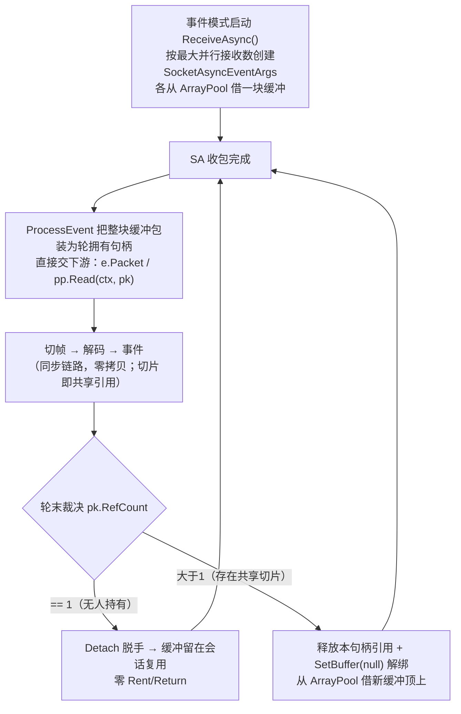
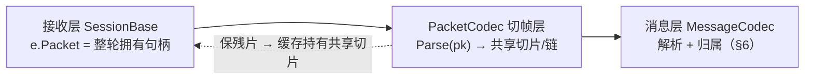

# 网络层零拷贝缓冲所有权架构

> 适用范围：NewLife.Core 网络接收链路（SocketAsyncEventArgs → SessionBase → 编解码器 → 消息层），
> 以及 NewLife.Remoting 的消息消费层（ApiClient 等）。
> 本文档描述"每次接收自有池化缓冲、所有权随包上移"的架构约定，是所有网络代码的内存规则基线。

> **文档基线**：本文档与当前分支（目标 v12）代码一一对应，不包含任何早期中间态/历史补丁描述。
> 要点速览：数据带出本轮的唯一通道是 `IPacket.Slice()`（共享切片，切出方持有引用、用后 Dispose；下游拿到的轮拥有句柄可直接交付应答/发送链路消费）；
> 接收层判断缓冲是否需换新的唯一信号是轮末轮句柄的 `RefCount`（==1 无人持有则脱手复用；大于1 存在跨轮共享切片，解绑换新）；
> `PacketCodec` 为单链缓存（帧头跨节点由链感知委托拼读），返回帧为共享切片/链（视图输入时为借阅视图）；
> 数据管道（`Pipe`）投递使用同一共享切片通道（轮末按 `RefCount` 自动换新缓冲，暂停水位时挂起接收事件参数），见《数据管道Pipe.md》；
> 切帧场景 S1~S5、算法细节、归属与 await 交付联合表见《数据包编码器PacketCodec.md》。

## 1. 目标

- **极致吞吐**：仅接收并上抛到应用层的路径，做到每消息零堆分配（零 GC）；
- **零拷贝**：接收 → 拆帧 → 协议解码 → 事件派发，全程切片不拷贝；
- **可维护**：用"所有权"规则从根上消除"借用视图被异步持有/跨线程使用"类踩坑。

## 2. 核心原则（两条铁律）

| 原则 | 说明 |
|---|---|
| **借阅视图只在本轮同步栈内有效** | `ArrayPacket`/`Memory<byte>` 等视图只允许在"本线程、本轮、同步"调用栈中使用，禁止保存到异步上下文、禁止跨线程传递。 |
| **所有权对象谁拿谁还，引用计数** | 池化缓冲（`ArrayPool` 借出）由 `ArrayOwner` 引用计数管理：`Slice` 为共享切片（每段递增计数、各句柄独立释放），最后一个引用归零时归还缓冲。 |

## 3. 接收缓冲生命周期（每轮包装句柄，有共享切片才换新）

规则：
1. 事件模式（`AutoReceive=true`）会话启动按最大并行接收数（TCP 默认 1，UdpServer 默认 CPU×1.6）创建并发接收 `SocketAsyncEventArgs`，每块从 `ArrayPool<Byte>.Shared` 借缓冲（`BufferSize`）；每轮把整块缓冲包装为轮拥有句柄直接上抛（下游可直接消费或交给应答/发送链路；需跨轮带出时在事件内经 `Slice` 切出共享切片）；轮末按引用计数裁决：计数为 1（无人持有）则 `Detach()` 脱手、缓冲留在会话复用；否则（已被下游消费归零、或存在共享切片）释放本句柄并解绑、换新缓冲（旧缓冲由最后释放的共享切片归还）；
2. 逃逸（跨线程/跨 await 携带）必须经 `Slice` 切出独立共享句柄（引用计数持有）；下游对轮句柄的消费/释放只作用于本轮，不影响其它轮次的缓冲归属；
3. 归还路径：①无人带出的缓冲由 `ReleaseRecv` 在会话关闭/断开时 `ArrayPool.Return`；②被带出的缓冲由最后一个共享句柄 `Dispose` 时归零归还；换新前先解绑（`SetBuffer(null)`），避免把已带出的旧缓冲二次归还（双重归还将引发脏读）。
4. 拉取模式（打开前设 `AutoReceive=false`）不启动接收环：`Receive/ReceiveAsync` 直接读 Socket，句柄由调用方释放，不参与轮末裁决。

## 4. Slice 共享切片：数据带出本轮的唯一通道

### 4.1 四条路径（三条合法 + 一条违禁）

| # | 场景 | 代码位置 | 频率 |
|---|---|---|---|
| ① | **RPC 响应交付**：命中 await 等待方，负载的共享切片直接交付 | `SessionBase.TryMatchResponse` → 拥有负载直交（容器回池前摘除） | 常见 |
| ② | **粘包残帧保留**：残片以共享切片挂入缓存链跨轮累积（S3/S4/S5，大帧跨轮必经） | `PacketCodec.Parse` → 缓存持有切片引用 | 大帧下常见 |
| ③ | **事件处理器主动带出**：事件内把当前帧带出本轮（跨线程/跨 await） | 业务代码：事件内 `e.Packet.Slice(...)` | 罕见 |
| ✗ | **意外逃逸**：不经 `Slice`，私自留存轮句柄或借用视图 | 任意代码（违规） | 必须评审拦截 |

- 三条合法路径语义完全一致：**切片即共享引用**（`Slice` 返回独立句柄，每句柄各自 `Dispose`，最后一个释放时缓冲归零归还）；
- **接收链路统一契约**：接收层每轮发放的是拥有句柄，下游任何组件（事件订阅者、编解码器、匹配队列、应答链）按同一纪律处理——同步消费直接用，跨轮带出先 `Slice`；
- 意外逃逸（第 ✗ 条）的防护分两层：拥有句柄逃逸会被引用计数捕获（凡带出必须 `Slice`；未 `Slice` 而私自留存的轮句柄在轮末 `Detach` 后作废，数据访问抛 `ObjectDisposedException`，fail-fast 而非静默脏读）；借用视图（`ArrayPacket` 等）逃逸无运行时保护，会读到下一轮复用的缓冲数据——评审必须拦截把视图存入字段/异步/队列。

### 4.2 切片原语与轮末裁决

- `IPacket.Slice(offset, count)`：共享切片（引用计数），各方各自 `Dispose`，最后一个释放时归还池；跨段自动组链、每段独立计数；
- `OwnerPacket.Detach()`：脱手（放弃本句柄引用但不归还缓冲），仅当计数为 1 时可用，供接收层轮末复用缓冲；
- 轮末唯一判据：轮句柄的 `RefCount`——为 1 则 `Detach` 复用；非 1（消费归零或存在共享切片）则释放本句柄并换新；
- 借用视图（`ArrayPacket` 等）不参与计数，仅本轮同步有效。

### 4.3 事件期间 Packet 的指向（三段式）

| 阶段 | `Packet` 指向 | 说明 |
|---|---|---|
| 进入接收链路 | 整轮轮拥有句柄 | `ProcessReceive` 设置 |
| `Received` 事件期间 | 当前消息帧（`FireRead` 临时改写） | 事件处理器同步读取 |
| 事件返回后 | 恢复原值（整轮句柄） | 需带出本轮的数据在事件内经 `Slice` 切出共享切片，与 Packet 恢复互不影响 |

### 4.4 接收层的响应（一条规则）

- 轮末检查轮句柄 `RefCount`：**等于 1（无人持有）→ `Detach()` 脱手，缓冲留在会话复用（零 Rent/Return）；大于 1（存在跨轮持有的共享切片）或已归零（被下游消费）→ 释放本句柄引用、`SetBuffer(null)` 解绑，从 `ArrayPool` 借新缓冲顶上**；
- 解绑先于借新：若 Rent 抛出（如 OOM），`se.Buffer` 已为 null，`ReleaseRecv` 不会把已被带出的旧缓冲二次归还（双重归还将引发脏读）。

## 5. 拆帧与协议解码（切帧层职责）

> **v12 过渡说明**：§5/§6/§7/§9/§10 的实现引用仍指向旧栈（`PacketCodec`/`MessageCodec`/`WebSocketMessage`，均已整删）；新架构下拆帧由 `MessagePump` + `IMessageCodec` 承担、匹配由 `SessionBase.TryMatchResponse` 承担、发送队列由 `SendPump` 承担，**所有权规则（§3/§4）不变**且仍是本文档的核心价值；旧实现引用待文档收口统一重写。

切帧层只回答两个问题：**切出什么帧**（形态与所有权）、**是否保留残片**（缓存持有切片）；
帧能否逃逸（跨 await）由消息层 §6 决定——codec 不预知帧是被 await 的响应还是同步推送。

### 5.1 帧三态与所有权速查

| 帧形态 | 场景 | 所有权与可持有性 |
|---|---|---|
| 借阅视图 `ArrayPacket` | 视图输入（直接调用） | 无所有权；落在调用方缓冲，仅同步链路内有效，禁止跨轮/跨线程持有 |
| 共享切片 `OwnerPacket` | 拥有句柄输入（接收链路） | 引用计数共享底层缓冲，可跨轮持有；各句柄 `Dispose`，最后一个归还 |
| 切片链 `OwnerPacket.Next` | S4/S5 跨段拼帧 | 链上每段各持一份引用；`Dispose` 链头递归释放全部段 |

各场景行为、算法流程图、代码方法地图详见《数据包编码器PacketCodec.md》；本文档只强调**所有权规则**。

### 5.2 残片保留规则（跨轮残片 = 缓存持有切片）

- **S3/S4/S5**：需把残片跨轮保留 → 缓存对残片切出共享切片（计数加一）挂入缓存链；接收层轮末见计数大于 1 即换新缓冲（§3）；残片零拷贝跨轮累积；
- **S1/S2**：无残片保留 → 轮末计数为 1，接收层 `Detach` 复用原缓冲；帧为共享切片（拥有句柄输入）或借阅视图（视图输入）；
- **无接收层句柄的通道**（直接调用，如 `Http.WebSocket`）→ 输入为借用视图时残片自动转自有拷贝进缓存链；连接结束时由 `HttpSession`/`WebSocket` 的 `Dispose` 归还该编码器（缓存链归还池）；
- 缓存链切帧：帧覆盖整条缓存时直接交出链节点句柄（零拷贝）；否则帧与剩余窗口各切一份共享切片（每段独立引用计数），不搬移数据。

### 5.3 定界契约（GetLength）

- `GetLength`（IPacket，链感知）：入参为缓存链头（帧首）；头部可解析 → 返回**完整帧长**（可能大于现有数据）；返回 0/负值仅表示“无法定界”（头部不足 / 分隔符未找到），等下一轮，非异常；
- 帧头可能跨节点（缓存不再并段补齐）：协议头用 `GetPrefix`/`ReadBytes` 跨段拼读；注意 `pk.Total` 是缓存总量而非帧长；
- 分隔符扫描类协议（SplitDataCodec）链内逐段扫描（含跨节点交界窗口），零拷贝，无需合并段流。

### 5.4 各编解码器与消息的适配

- `StandardCodec`/`LengthFieldCodec`/`WebSocketCodec` 在 `PacketCodec.Parse(pk)` 切帧后解析为消息，帧用毕 `TryDispose()`、负载为独立共享切片随消息持有；`SplitDataCodec` 把切出的帧本身直交下游，同步消费完成后统一归还（零拷贝，跨轮带出由下游 `Slice`）；四者粘包编码器均按会话隔离存放；
- `IMessageCodec.TryParse(ReadOnlySequence)` 为主入口：头部解析取头 4/8 字节（单段直接引用 / 链式跨段拼入栈缓冲，不物化整帧），负载用 `pk.Slice(size, len)` 切出共享切片归 `Payload`（引用计数独立持有，消息 `Dispose` 时释放）；借阅视图（`ArrayPacket`）只取视图；
- `IMessage.Payload` 为 `IPacket`：拥有帧的所有权随消息持有，消息 `Dispose` 时唯一归还（写路径统一走 `SetBody`）；借阅视图无所有权，仅本轮同步链路内有效。无独立的 Owner 字段，`Payload` 是唯一所有权载体。
- **处理器实例跨会话共享**（服务器创建会话时直接引用服务器管道）、跨轮状态必须挂会话：粘包编码器存 `context.Owner` 的 `IExtend`（`ss["Codec"]`；`WebSocketCodec` 为避免与消息族编码器冲突使用独立键 `"WebSocketCodec"`），禁止用处理器实例字段（曾致多客户端并发时跨会话串包）；会话关闭时各编码器 `Close` 归还本会话编码器（`Dispose` 清空段链、归还池化缓冲）。

## 6. 请求/响应匹配与事件顺序（消息层归属）

先事件后匹配；匹配时按负载归属处理（实现：`SessionBase.TryMatchResponse`）：

1. **先触发事件（`base.Read`），后 `queue.Match` 匹配**——监视型订阅者（`Received`）先同步看到消息/负载，等待方 continuation 异步执行，与同步事件链无竞态；
   - **生命周期互不影响**：事件订阅者跨轮持有数据必须经 `Slice` 切出独立共享切片（计数加一）；订阅者持有不影响响应匹配交付，匹配交付也不影响订阅者手中的切片，各自 `Dispose` 归零后才归还池；
2. **事件负载交付形态**：`UserPacket=true` → 负载（`IPacket`：拥有帧切片或借阅视图）上抛；`false` → 消息整体上抛；
3. **命中匹配**（Reply 且队列有待）按负载归属分三类：
   - **拥有负载**（`Payload is IOwnerPacket`，S2/S3/S5 拥有帧在解析时已把引用随切片移动给负载）：`UserPacket=true` → 负载直接交付等待方（容器回池前 `SetBody(null)` 防二次归还）；`false` → 消息整体交付（等待方 Dispose 消息即归还负载）；
   - **拥有负载**（`Payload is IOwnerPacket`，接收链路共享切片）：`UserPacket=true` → 负载直接交付等待方（容器回池前 `SetBody(null)` 摘除）；`false` → 消息整体交付（等待方 `Dispose` 消息即归还）；
   - **兜底**：借阅视图（非拥有输入）或非 Message 实现 → `Payload.Clone()` 克隆为独立拥有副本后交付；
4. **等待方在 continuation 内解码后唯一归还**（Dispose 负载或消息）；
5. 切帧场景（S1~S5）× 消息层归属 × await 交付的联合表见《数据包编码器PacketCodec.md》→“下游归属与 await 赠送”。

## 7. 所有权转移与归还总表

| 场景 | 缓冲申请 | 所有权去向 | 归还点 |
|---|---|---|---|
| 纯接收、同步消费（推送/监视） | 池化接收缓冲（每轮包装句柄） | 无人持有（计数为 1） | 轮末 `Detach` 复用，不归还 |
| 匹配响应命中（`UserPacket=true`） | codec 拥有切片（负载） | 负载共享切片直交 await 方 | 请求方 Dispose 负载 |
| 匹配响应命中（`UserPacket=false`） | codec 拥有切片 | 消息持有负载，整体交付 | 等待方 Dispose 消息 |
| 未命中池化消息（请求/推送） | codec 帧（共享切片/链） | `Payload` 独立持有 | 池化消息 `Reset`/`Dispose` 归还 |
| 事件监视跨轮持有（UserPacket） | codec 切片链 → 负载链 | 事件内 `Slice` 独立持有 | 持有方 Dispose |
| 会话关闭 | 各编码器缓存链残片 | 网络层 | `ReleaseRecv` 归还 se.Buffer；各编码器 `Close` 归还本会话 `PacketCodec`（清缓存链、归还池缓冲） |

## 8. 禁止事项（踩坑清单）

- ❌ 在事件回调之外持有 `Memory`/`ArrayPacket` 视图；
- ❌ 把视图存进异步状态机、`Task`、`ConcurrentQueue`、类字段；
- ❌ 头部扩展（`ExpandHeader` 原地接管）后继续读取源实例（源已整体作废，数据访问抛 `ObjectDisposedException`；后续一律使用返回的新实例）；
- ❌ 接收层在轮句柄计数大于 1 时仍复用该缓冲（必须解绑换新；旧缓冲由最后释放的切片归还）；
- ❌ 匹配逻辑对已独立持有的负载再做二次克隆（丧失零拷贝收益）；
- ❌ 事件处理器手工置空/改写 `e.Packet`（需要带出本轮时在事件内经 `Slice` 切出共享切片；`FireRead` 对 Packet 的临时改写一律还原）；
- ❌ 不经 `Slice` 私自留存轮句柄或借用视图带出本轮（轮句柄留存随轮末 `Detach` 作废、fail-fast；借用视图逃逸无运行时保护，会读到下一轮复用的缓冲数据——静默脏读，评审必须拦截）；
- ❌ 对同一缓冲“共享了却期望自动归还”（共享≠免释放：每个句柄都必须 `Dispose`，否则计数不归零、池缓冲流失）；
- ❌ 把借用视图（`ArrayPacket` 等）交给异步上下文/存储后继续使用（借用视图只在本轮同步调用栈内有效）。
- ❌ 在处理器（编码器）实例字段保存跨轮/跨会话状态（处理器实例被多会话共享，会串包串帧；会话态必须挂 `context.Owner`）。
- ❌ `UserPacket=true` 模式下不 `Slice` 直接留存负载引用跨轮——容器（`DefaultMessage`）回池时其持有的那份引用被释放，直接留存的引用会失效；需要带出本轮必须：事件内 `Slice` 切出独立共享切片（推荐）、或自行拷贝、或改用 `UserPacket=false` 由消费方接管消息本体。

## 9. 验证与测试基线

当前实现由 `XUnitTest.Core` 覆盖，关键测试点：

| 域 | 覆盖点 |
|---|---|
| 切帧层 `PacketCodec` | S1 整帧转移 / S2 逐帧共享切片 / S3 残片跨轮（缓存持切片）/ S4 续挂 / S5 跨节点组链、视图输入残片转拷贝、分隔符跨段扫描、帧头跨段、超大帧跨多轮 |
| 消息解析与所有权 | `DefaultMessage` 头部/超大包/跨段链解析、消息容器按需创建与释放（`Dispose`）、`MessageDispose` 引用计数唯一归零归还、`Slice` 链式各段独立计数、`Detach` 脱手复用、借用视图头释放尾链 |
| 网络集成 | Tcp/Udp/WS 收发、请求-响应匹配、事件先于匹配、订阅者持有不影响匹配、轮末按引用计数换新/复用、无等待方应答安全归还、变长长度字段跨段大帧（`CodecIntegration` / `NetIntegration` / `UnmatchedReplyTests`） |
| WebSocket | `WebSocketMessage` 帧解析、长度扩展、掩码与所有权、链式大帧（>8KB 跨段）零拷贝解码（掩码跨段 XOR）、多会话并发状态隔离（`WebSocketCodecSessionTests`） |
| JsonCodec | 链式负载跨段解码（>4KB 分批组链） |

> 全量基线以 `XUnitTest.Core` 为准（Core 主仓 2700+ 用例，**全量 0 失败**为发布门槛）。
> 任何代码改动保持“编译 + 相关测试全绿”后再提交。

## 10. 演进方向（未定 / 待评估）

### 已落地
- 切片模型统一：`Slice` 一律返回引用计数共享句柄（删 `transferOwner` 参数与 `Share`），新增 `RefCount` 观测与 `Skip` 窗口前移，`Free` 退役（`Detach` 取代）；三参 `Slice` 与 span 版委托等旧签名原以 `[Obsolete]` 短转发保留，**v12 已删除**（破坏性，需下游重编译）；
- `Slice` 返回类型收窄：`OwnerPacket.Slice` 公开返回具体类型（可直接 `using`），`IPacket.Slice`/`IOwnerPacket.Slice` 为显式接口实现；**属 v12 破坏性变更**——对旧版编译、以具体类型接收者调用两参 `Slice` 的二进制会抛 `MissingMethodException`（CLR MemberRef 绑定含返回类型）。按组件统计（扫描 1.5 万 DLL，不含单元测试）：产品组件仅 **NewLife.MySql**（`AuthenticateAsync` 等 4 处调用点，覆盖全部已发布版本），随同步重编译发版消除、源码零改动；其余产品组件不受影响（Remoting 仅三参调用、MQTT/Modbus/Video 等仅接口调用）。三参兼容重载与 `IPacket.Slice` 签名不变；外部自定义 `IOwnerPacket` 实现类需补实现该接口成员；
- 接收层每轮包装句柄 + 轮末引用计数裁决：计数为 1 → `Detach` 脱手复用（零 Rent/Return）；否则解绑换新；缓冲归还恰好一次；
- `IMessage.Payload` 为 `IPacket` 单一所有权载体；`Read(IPacket)` 为主入口，负载以共享切片独立持有，帧头跨段零物化；
- `PacketCodec` 单链缓存：帧恰好覆盖整条缓存时直接转移句柄；跨节点帧 `Slice` 自动组链；借阅残片跨轮自动转自有拷贝；
- 协议解析对链式帧零物化：`DefaultMessage` 头 8 字节栈缓冲拼段，`WebSocketMessage` 头部索引直读 + 掩码逐段 XOR，`JsonCodec` 跨段读取；
- 跨轮状态一律按会话隔离（`ss["Codec"]` / `ss["WebSocketCodec"]`），会话关闭自动归还缓存缓冲；匹配未命中的应答（无等待方）立即归还拥有缓冲，不再无人释放；
- WebSocket 链式收发闭环：读侧头部索引直读 + 掩码逐段 XOR，写侧 `ToPacket` 掩码逐段 XOR（链式负载可直接发送）；Http 通道连接结束由 `HttpSession`/`WebSocket` 的 `Dispose` 归还粘包编码器。

### 仍开放
1. **Remoting 消费层复核**：`ApiMessage`/`EncoderBase`/`HttpMessage` 等对 `IMessage.Payload`（`IPacket`）的所有权消费语义需确认（Core 改型后跨仓适配，含三参 `Slice` 调用迁移到两参）；
2. **兼容垫片清理**：三参 `Slice` / `Free` 已在 v12 删除（破坏性）；`GetLength2` span 委托已随帧引擎重构删除。Remoting 侧三参调用迁移尚未完成，需随大版本重编译发版；
3. **零 GC 压榨**：热点实例池化 + BenchmarkDotNet 量化报告（数据见《内存分配与拷贝成本报告》）；析构兜底按 `#if DEBUG || OWNERPACKET_FINALIZER` 条件编译，发布版零终结开销。

> 逐项推进以"编译 + 全量测试绿"为门槛；属破坏性内容，宜在发版前统一决策。
